# EGF Pipeline (Reusable Block)

**SPDX-License-Identifier:** MIT-0
**Author:** Jeleel Muibi | **Last Updated:** 2025-09-10 | **Classification:** Executive Summary | HybridOps.Studio

This document provides a **single, reusable Mermaid diagram** for the Environment Guard Framework (EGF) pipeline. Copy the block into any role README to keep visuals **consistent** across the project.

---

## Mermaid Block

```mermaid
flowchart LR
  %% Reusable EGF pipeline block (copy/paste across READMEs)
  classDef gov fill:#001f3f,stroke:#A0C4FF,color:#fff
  classDef inv fill:#0b3d91,stroke:#A0C4FF,color:#fff
  classDef sel fill:#2a6f97,stroke:#A0C4FF,color:#fff
  classDef map fill:#1f7a8c,stroke:#A0C4FF,color:#fff
  classDef val fill:#2b9348,stroke:#A0C4FF,color:#fff
  classDef dep fill:#7f4f24,stroke:#E9C46A,color:#fff

  A[env_guard
Governance & CID]:::gov --> B[gen_inventory
Placeholder Inventory]:::inv
  B --> C[host_selector
Target Selection]:::sel
  C --> D[ip_mapper
Dynamic IP Resolution]:::map
  D --> E[connectivity_test
Pre-Deploy Gate]:::val
  E --> F[deployment
Controlled Rollout]:::dep

  %% Optional: clickable links (rendering depends on platform)
  %% click A "../roles/common/env_guard/README.md" "env_guard"
  %% click B "../roles/common/gen_inventory/README.md" "gen_inventory"
  %% click C "../roles/common/host_selector/README.md" "host_selector"
  %% click D "../roles/common/ip_mapper/README.md" "ip_mapper"
  %% click E "../roles/common/connectivity_test/README.md" "connectivity_test"
```

---

## Notes
- **Order is authoritative** for governance and IP abstraction. Real IPs **only** appear after `ip_mapper` runs.
- Use this from the **project root** docs: `docs/egf_pipeline.md`.
