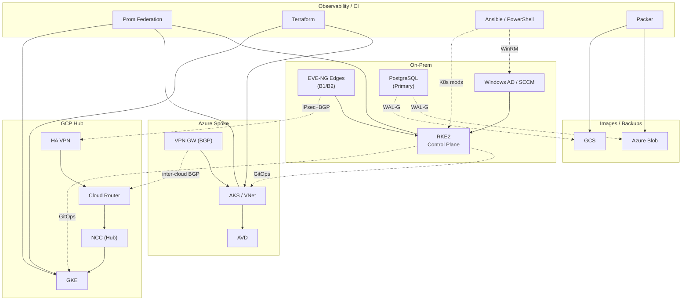

# HybridOps.Studio — Hybrid Cloud Automation Portfolio

[](https://opensource.org/licenses/MIT-0)
[](https://terraform.io)
[](https://ansible.com)
[](https://www.youtube.com/watch?v=YOUR_VIDEO_ID "Watch the HybridOps.Studio demo on YouTube")
[](#live-demo)

**HybridOps.Studio** is a product-led blueprint for hybrid cloud operations: on‑prem control with Kubernetes + GitOps, and cloud failover/burst on Azure or GCP. It demonstrates enterprise‑grade automation patterns with reproducible runs and linked evidence.

---

## Highlights

- **Zero-touch control plane:** Provisions a Jenkins controller (`ctrl-01`) on Proxmox in ~10 minutes via cloud-init Day-0/Day-1 automation—fully Git-driven and evidence-backed.  
- **Image factory (Packer):** Golden images for Ubuntu 22.04/24.04, Rocky 9, and Windows Server 2022 feed ctrl-01 and ephemeral agents.  
- **Source of truth:** NetBox-driven inventory with Ansible dynamic discovery.  
- **GitOps everywhere:** Argo CD / Flux manage desired state across clusters; Rancher optional for fleet access.  
- **Resilient data:** PostgreSQL remains authoritative on-prem; WAL-G backups to cloud storage; fast promotion for DR.  
- **Networking backbone:** Google Network Connectivity Center (NCC) as hub; on-prem and cloud VNets/VPCs as spokes.  
- **Observability first:** Prometheus federation across sites; shared Grafana views.  
- **Policy-driven DR/burst:** Decision Service evaluates federation metrics plus Azure/GCP monitor signals and available credits.  
- **Operator workflow:** No click-ops—Make, Terraform, Ansible, and thin shell wrappers power everything.  
- **Evidence-backed:** Every claim maps to logs, outputs, screenshots, or dashboards.

**Target KPIs:** RTO ≤ 15 m · RPO ≤ 5 m · Packer ≤ 12 m · Terraform ≤ 10 m · Autoscale +2 @ 70% (scale-in < 40%).

---

## Cost & Telemetry (evidence-backed)

Cost is a first-class signal in HybridOps.Studio. Pipelines emit verifiable cost artifacts and enforce budget guardrails before burst/DR actions. The same artifacts power dashboards and reports.

- Guide: [Cost & Telemetry](./docs/guides/cost-model.md)  
- Evidence: [Proof archive → cost](./docs/proof/cost/)  
- Policy hooks: [Decision Service](./control/tools/decision)

---

## Control Plane Context

The control plane (`ctrl-01`) anchors HybridOps.Studio—auto-provisioned from Packer-built golden images, parameterised by Terraform via cloud-init, and continuously evidenced by Jenkins from build through runtime.

<details>
<summary><strong>Deep Dive: Zero-Touch Control Plane (ctrl-01)</strong></summary>

<p align="right"><sub><em>Click again to collapse this section</em></sub></p>

# HybridOps Studio — Control Plane (ctrl‑01) Strategy

### Purpose
Show a zero‑touch, production‑minded control plane that:
- boots from one Day‑0 script on Proxmox  
- self‑configures (Day‑1) entirely from Git  
- hands orchestration to Jenkins  
- executes workloads on ephemeral agents  
- produces durable evidence for every run  

---

### Elevator Pitch
> Buy a server, install Proxmox, run one script.  
> Ten minutes later you get a Jenkins control plane that builds infra on disposable agents and writes proofs into the repo.  
> Clean separation, easy DR, auditable.

---

### Architecture Summary
- **Jenkins Controller:** `ctrl-01` — a clean VM, not a container.  
- **Ephemeral Agents:** cloud‑init clones of a gold image, destroyed after jobs.  
- **Source of Truth:** Git repository defines Day‑0/Day‑1 state, pipelines, and evidence structure.  
- **Evidence Output:** stored under `docs/proof/ctrl01/<timestamp>/` with a `latest` symlink.

---

### Flow
```bash
Day-0 → Proxmox creates VM + injects cloud-init metadata
Day-1 → VM runs bootstrap.sh from Git (installs Jenkins, seeds jobs)
Day-2+ → Jenkins pipelines provision infra + collect evidence
```

---

### Evidence & Observability
| Artifact | Location |
|-----------|-----------|
| Bootstrap Log | `/var/log/ctrl01_bootstrap.log` |
| Evidence Folder | `docs/proof/ctrl01/<timestamp>/` |
| Latest Symlink | `docs/proof/ctrl01/latest` |
| Jenkins Init Scripts | `/var/lib/jenkins/init.groovy.d/` |

---

### Design Principles
- **Clean separation:** Controller orchestrates; agents execute.  
- **Ephemeral compute:** Agents are temporary; controller state is Git‑driven.  
- **Immutable evidence:** Every run emits verifiable outputs tied to a commit.  
- **Self‑healing:** Failures are rebuilt deterministically.  
- **Audit‑ready:** Jenkins emits proofs directly into the repo.

---

### DR Snapshot (Quick Recovery)
1. Snapshot or export the VM.  
2. Restore via Proxmox API or Terraform import.  
3. Resume pipelines; RPO validated via evidence timestamps.  

---

<p align="right"><sub>↑ Collapse to continue reading.</sub></p>
</details>

---

## Quickstart — Try It Yourself (no credentials required)

<details>
<summary><strong>🟢 Option A — Zero-auth look-only (fastest)</strong></summary>

Review pre-generated artifacts (no installs, no accounts):

- [AKV evidence](docs/proof/akv/) — soft-delete, purge protection, RBAC snapshot, private endpoint status
- [Packer evidence](docs/proof/platform/packer-builds/) — template build proofs (artifacts, proof.json, full logs)
- [Terraform evidence](docs/proof/terraform/) — plan JSON hashes, non-destructive plan outputs
- [Pipeline logs](docs/proof/pipelines/) — Jenkins/Terragrunt logs (secrets masked)
- [Screenshots](docs/screens/) — pipelines, dashboards
- [Runbooks](docs/runbooks/) — short “how it works” guides

This shows outcomes and governance without any tokens.
</details>

<details>
<summary><strong>🟡 Option B — Local smoke (no Terraform Cloud, no cloud creds)</strong></summary>

Tokenless validation of repo structure & Terragrunt wiring. Does **not** touch cloud or remote state.

```bash
# 0) Get the repo
git clone https://github.com/jeleel-muibi/hybridops.studio.git
cd hybridops.studio

# 1) (If needed) install Terragrunt (Linux x86_64)
TG_VER="v0.67.4"
curl -fsSL -o terragrunt "https://github.com/gruntwork-io/terragrunt/releases/download/${TG_VER}/terragrunt_linux_amd64"
chmod +x terragrunt && sudo mv terragrunt /usr/local/bin/terragrunt

# 2) Run the tokenless smoke (no backend, no providers)
cd infra/terraform/live/_smoke/tfc-backend
terragrunt hclfmt || true
terraform init -backend=false
terraform validate
```
</details>

<details>
<summary><strong>🔵 Option C — Remote backend plan with <em>your</em> Terraform Cloud token (non-destructive)</strong></summary>

Use your own free TFC user token to see remote backend + workspace wiring. No provider creds; **no resources created**.

```bash
# 0) Get the repo
git clone https://github.com/jeleel-muibi/hybridops.studio.git
cd hybridops.studio

# 1) Authenticate to Terraform Cloud (opens browser)
terraform login

# 2) Safe plan against TFC (no resources created)
cd infra/terraform/live/_smoke/tfc-backend
terragrunt init
terragrunt plan -refresh-only -no-color
```

Expected: init mentions `app.terraform.io`; plan shows **no changes** and prints an output.
</details>

<details>
<summary><strong>🟣 Option D — Provision ctrl-01 on your Proxmox (optional, real infra)</strong></summary>

**Secrets are pulled from AKV via [`control/tools/secrets/secrets.sh`](control/tools/secrets/secrets.sh)** (per
[ADR-0015](docs/adr/ADR-0015_secrets-strategy_akv-now_sops-fallback_vault-later.md)).
Follow **[HOWTO: ctrl-01 Provisioner](docs/howto/HOWTO_ctrl01_provisioner.md)** for the exact steps and prerequisites (AKV stack applied via Terragrunt/TFC, then ctrl-01 bootstrap reads Jenkins admin password from AKV).  
No credentials are published here; bring your own infra and token.
</details>

> **Why no shared tokens?** For security and auditability, this project never distributes reusable credentials.  
> Options A–B need none; Option C uses your TFC token for a non-destructive plan; Option D is bring-your-own infra with AKV-based secret retrieval.  
> For read-only demo sessions with one-time credentials, see **[contact](CONTRACTING.md#contact)**.

## Architecture (executive view)

<p align="center">
  
</p>

<details>
  <summary><strong>Mermaid fallback (compact, readable)</strong></summary>

> **Legend:** solid = control/data · dotted = IPsec/BGP, GitOps, config, backups


</details>

**See more diagrams:** [Network Design](./docs/diagrams/network/README.md) · [Full Architecture (Mermaid)](./docs/diagrams/mermaid/architecture-overview.md)

---

## Evidence

- [**Evidence Map**](./docs/evidence_map.md) — main index mapping claims (DR, cost, images, SoT, networking) to proof folders and runbooks.
- [**Proof Archive**](./docs/proof/README.md) — curated screenshots, exports and logs grouped by theme.

<details>
<summary><strong>🔎 Evidence Map (click to expand)</strong> — claim → proof links</summary>

### KPIs
- **RTO ≤ 15m** — [Grafana DR panel](./docs/proof/observability/images) · [Runbook timings](./docs/proof/others/assets)
- **RPO ≤ 5m** — [SQL read-only promotion / log shipping](./docs/proof/sql-ro/images)
- **Image build ≤ 12m** — [Packer builds (proofs)](./docs/proof/platform/packer-builds/README.md)
- **Terraform ≤ 10m** — [CI logs: plan/apply](./docs/proof/others/assets)
- **Autoscale +2@70%** — [Alert → scale event trace](./docs/proof/observability/images)

### Architecture assertions
- **Jenkins Control Plane (ctrl-01)** — [Provision & Evidence Bundle](./docs/proof/ctrl01/)
- **NCC hub-and-spoke** — [Topology & routes](./docs/proof/ncc/images)
- **Prometheus Federation** — [Targets & dashboards](./docs/proof/observability/images)
- **SQL RO in cloud for DR** — [Replica/RO dashboards](./docs/proof/sql-ro/images)
- **Runtime images to Blob/GCS** — [Artifact listings & screenshots](./docs/proof/images-runtime/images)
- **Decision Service (policy-governed)** — [Decision outputs & policy](./docs/proof/decision-service/images)
</details>

---

## Showcase Catalog

This section provides hands-on demonstrations of HybridOps.Studio capabilities. Each showcase includes documentation, runnable examples, and evidence of successful execution.

> **Quick start:** Use `make showcase.avd-zerotouch-deployment.demo` to launch the AVD Zero-Touch showcase.  
> The [root Makefile](./Makefile) routes all showcase targets and ensures each run emits evidence.

Authoritative showcase index:

- **Showcases overview:** [docs/showcases/README.md](./docs/showcases/README.md)

Representative scenarios documented there include:

- AVD zero-touch deployment (with an advanced networking variant).  
- CI/CD pipeline from image factory (Packer) through Terraform/Ansible into Kubernetes.  
- DR failover and failback between on-prem and cloud.  
- Kubernetes autoscaling and controlled burst to cloud.  
- Network automation using Nornir (programmatic) and Ansible (declarative).  

Each showcase page links to:

- The relevant runbooks under `docs/runbooks/`  
- Proof artefacts under `docs/proof/...`  
- Supporting ADRs and HOWTOs

---

## Repository layout

- [**Control**](./control/README.md) — operator wrappers, provisioning scripts, and the decision service  
  - [control/tools/](./control/tools/) — repo utilities (index generators, provisioners)  
  - [control/decision/](./control/decision/README.md) — burst/DR policy, signals, and actions

- [**Packer**](./infra/packer/README.md) — immutable base images (Linux, Windows, RKE2, Jenkins agents)  
  - `templates/`, `scripts/`, `vars/` — uploads to object storage or hypervisor templates

- [**Terraform**](./infra/terraform/README.md) — modules and environment stacks (on-prem / Azure / GCP)  
  - `modules/`, `envs/` — remote state and policy gates

- [**Core**](./core/README.md) — reusable Ansible roles, shared libraries, and helpers

- [**Deployment**](./deployment/README.md) — inventories, playbooks, and GitOps overlays (k8s manifests)

- [**Docs**](./docs/README.md) — documentation hub  
  - [ADRs](./docs/adr/README.md) · [Runbooks](./docs/runbooks/README.md) · [HOWTOs](./docs/howto/README.md) · [Guides](./docs/guides/) · [Proof Archive](./docs/proof/README.md)

- [**Contrib**](./contrib/README.md) — helper references · [Scripts ↔ Playbooks](./contrib/scripts-playbooks.md)

- [**CI (docs)**](./docs/ci/README.md) — pipelines overview (Jenkins & GitHub Actions)

- [**Makefile**](./Makefile) — root build/ops targets

---

## Reuse these modules & roles

- **Ansible roles (Galaxy):** Versioned releases are published under my namespace.
  ```bash
  ansible-galaxy role install <namespace>.<role_name>
  ```

- **Terraform modules (Registry):** Provider‑specific modules with SemVer tags.
  ```hcl
  module "burst_cluster" {
    source  = "app/org/hybridops-burst-cluster/azure" # or gcp
    version = "~> 0.1"
  }
  ```

---

## Design Principles

- RKE2 on‑prem provides compliant, deterministic control; GitOps remediates drift.
- Google NCC enables hub‑and‑spoke connectivity across on‑prem and clouds.
- Prometheus Federation aggregates cross‑site metrics; the Decision Service combines these with Azure/GCP monitors and available credits to select the target for failover/burst.
- PostgreSQL remains authoritative on‑prem; cloud replicas/promotions are used for DR speed, with WAL‑G managing offsite backups and restores.
- Windows workloads (DC/SCCM/SQL) remain on‑prem unless explicitly included in DR scenarios.

---

## Operations

- Run procedures — **[Runbooks](./docs/runbooks/README.md)**
- Operator entry points — **[Control](./control/README.md)** (invokes canonical playbooks, Terraform, and GitOps)

<details>
  <summary><strong>Quick commands (optional)</strong></summary>

```bash
# Prep & sanity
make env.setup sanity

# On-prem bootstrap (baseline)
make control.orchestrate.onprem

# End-to-end DR flow (pick provider)
CLOUD_PROVIDER=azure make control.orchestrate.dr   # or: gcp

# Export Terraform outputs → CSV, then plan a NetBox sync (no writes)
make control.tf.csv
NETBOX_URL=https://netbox.local NETBOX_TOKEN=*** make control.netbox.plan
```

Direct wrappers (optional):
```bash
control/bin/rke2-server.sh
control/bin/rke2-agent.sh
control/bin/gitops-bootstrap.sh --dry-run
control/bin/dr-dns-cutover.sh azure
```
</details>

### Security at a glance
- RBAC & GitOps drift control — **[SecOps Roadmap](./docs/guides/secops-roadmap.md)**
- Secrets management — **[Technical Architecture › Secrets](./docs/briefings/technical_architecture.md#secrets-management)**
- Backup/DR (WAL-G, RPO/RTO) — **[Evidence Map](./docs/evidence_map.md)**

### Briefing Pack
- **Global Talent assessors:** [How to review HybridOps.Studio](./docs/briefings/gtv/how-to-review.md)
- **[Executive Summary](./docs/briefings/executive_summary.md)** — high-level goals and value
- **[Project Overview](./docs/briefings/project_overview.md)** — repo structure & navigation
- **[Technical Architecture](./docs/briefings/technical_architecture.md)** — components & flows with proof links

---

## Community & Support

> This repository is a public, evidence‑backed portfolio intended for assessment.

- **Contribution policy:** External PRs are not accepted. For clarifications, please read the docs or use the channels in **Support**.
- **Contributing guidelines:** see [Contributing](./CONTRIBUTING.md)
- **Code of Conduct:** see [Code of Conduct](./.github/CODE_OF_CONDUCT.md)
- **Security Policy:** see [Security Policy](./.github/SECURITY.md)
- **Support:** see [Support](./.github/SUPPORT.md)

---

## Contact & Licensing

- **Engagements:** see **[Contracting](./CONTRACTING.md)** for services and contact details.
- **Code:** MIT‑0 — see **[License](./LICENSE)**.
- **Docs/diagrams:** CC‑BY‑4.0 — see **[Docs License](./docs/license-docs.md)**.
- Branding/wordmarks noted in **[Notice](./NOTICE)**.

<sub>© HybridOps.Studio — Designed by Jeleel Muibi · All product names/logos are trademarks of their respective owners.</sub>
