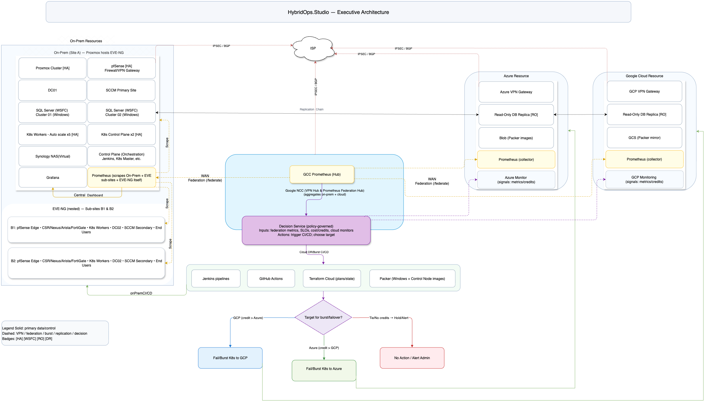
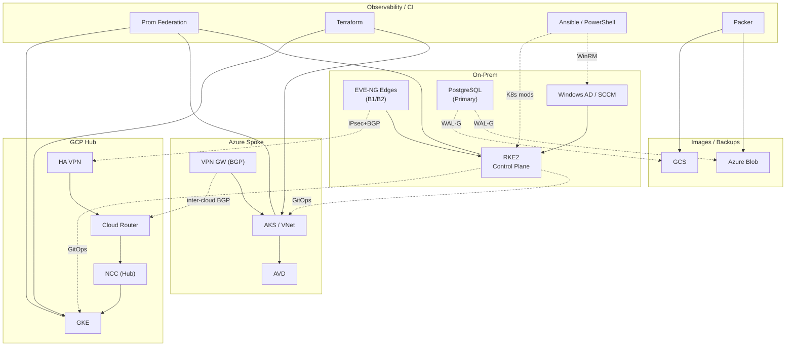

# HybridOps.Studio — Hybrid Cloud Automation Portfolio

[](https://opensource.org/licenses/MIT-0) &nbsp;
[](https://www.youtube.com/watch?v=YOUR_VIDEO_ID "Watch the live HybridOps.Studio demo on YouTube") &nbsp;
[](#)

**HybridOps.Studio** is a product-led blueprint for hybrid cloud operations: **on-prem control** with **Kubernetes + GitOps**, and **cloud failover/burst** on Azure or GCP.
It demonstrates enterprise-grade automation patterns with reproducible runs and linked evidence.

---

## Highlights

- **Zero-Touch Control Plane:** Provisions Jenkins controller (`ctrl-01`) on Proxmox in ≈10 min via cloud-init Day-0/Day-1 automation — fully Git-driven and evidence-backed.  
- **Source of Truth:** NetBox-driven inventory with Ansible dynamic discovery.  
- **GitOps Everywhere:** Argo CD / Flux manage desired state across clusters; Rancher optional for fleet access.  
- **Resilient Data:** PostgreSQL authoritative on-prem; WAL-G backups to cloud storage; fast promotion for DR.  
- **Networking Backbone:** Google Network Connectivity Center (NCC) as hub; on-prem and cloud VNets/VPCs as spokes.  
- **Observability First:** Prometheus Federation across sites; shared Grafana views.  
- **Policy-Driven DR/Burst:** Decision Service evaluates federation metrics + Azure/GCP monitor signals + available credits.  
- **Operator Workflow:** No click-ops — Make, Terraform, Ansible, and shell wrappers power everything.  
- **Evidence-Backed:** Every claim maps to logs, outputs, screenshots, or dashboards.  

**Target KPIs:** RTO ≤ 15 m  ·  RPO ≤ 5 m  ·  Packer ≤ 12 m  ·  Terraform ≤ 10 m  ·  Autoscale +2 @ 70 % (scale-in < 40 %).

---

### 🧭 Control Plane Context

The control plane (`ctrl-01`) is the foundation of HybridOps.Studio — it’s the first proof of zero-touch automation.  
See below for a **deep dive** into how it bootstraps itself, generates evidence, and drives the rest of the platform.

<details>
<summary><strong>📘 Deep Dive: Zero-Touch Control Plane (ctrl-01)</strong></summary>

<p align="right"><sub><em>Click again to collapse this section</em></sub></p>

---

### Purpose
Show a zero-touch, production-minded control plane that boots from one Day-0 script on Proxmox,  
self-configures (Day-1) entirely from Git, hands orchestration to Jenkins, executes on ephemeral agents,  
and produces durable evidence for every run.  

---

### Elevator Pitch
> “Buy a server, install Proxmox, run one script.  
> Ten minutes later you get a Jenkins control plane that builds infra on disposable agents and writes proofs into the repo.  
> Clean separation, easy DR, auditable.”

---

### Architecture Summary
- **Jenkins Controller:** `ctrl-01` — a clean VM, not a container.  
- **Ephemeral Agents:** cloud-init clones of a gold image, destroyed after jobs.  
- **Source of Truth:** Git repo defines Day-0/Day-1 state, pipelines, and evidence structure.  
- **Evidence Output:** `docs/proof/ctrl01/<timestamp>/` with a `latest` symlink.

---

### Flow
```bash
Day-0 → Proxmox creates VM + injects cloud-init metadata  
Day-1 → VM runs bootstrap.sh from Git (installs Jenkins, seeds jobs)  
Day-2+ → Jenkins pipelines provision infra + collect evidence
```

---

### Evidence & Observability
| Artifact | Location |
|-----------|-----------|
| Bootstrap Log | `/var/log/ctrl01_bootstrap.log` |
| Evidence Folder | `docs/proof/ctrl01/<timestamp>/` |
| Latest Symlink | `docs/proof/ctrl01/latest` |
| Jenkins Init Scripts | `/var/lib/jenkins/init.groovy.d/` |

---

### Design Principles
- Clean separation · Ephemeral compute · Immutable evidence · Self-healing · Audit-ready  

---

### DR Snapshot (Quick Recovery)
1. Snapshot or export the VM.  
2. Restore via Proxmox API or Terraform import.  
3. Resume pipelines; RPO validated via evidence timestamps.  

---

<p align="right"><sub>↑ Collapse to continue reading about overall architecture and evidence links.</sub></p>
</details>

---

## Quickstart — Try It Yourself

<details>
<summary><strong>🟢 Run it yourself or try the live demo (click to expand)</strong></summary>

<p align="right"><sub><em>Click again to collapse this section</em></sub></p>

### Option 1 — Live Demo (Recommended)

📺 Prefer a walkthrough? [Watch the official YouTube demo](https://www.youtube.com/watch?v=YOUR_VIDEO_ID)

> You can **SSH into a live demo environment** and **watch the control plane and its apps come alive in real time**.  
> Jenkins pipelines automatically trigger RKE2, NetBox, and monitoring stacks — all visible as they build.

```bash
ssh demo@hybridops.studio
# password: TryHybridOps!
```

Then open the **Proxmox Viewer** to **see the environment come alive** —  
VMs booting, pipelines firing, and dashboards lighting up as automation takes over.  

🔗 [https://demo.hybridops.studio/viewer](https://demo.hybridops.studio/viewer)

*Demo sessions are read-only and reset hourly to ensure a clean environment.*

---

### Option 2 — Run on your own Proxmox host

```bash
curl -fsSL https://raw.githubusercontent.com/jeleel-muibi/hybridops.studio/main/control/tools/provision/provision-ctrl01-proxmox-ubuntu.sh   -o /root/provision-ctrl01-proxmox-ubuntu.sh &&   chmod +x /root/provision-ctrl01-proxmox-ubuntu.sh &&   sudo JENKINS_ADMIN_PASS='<secret>' /root/provision-ctrl01-proxmox-ubuntu.sh
```

This Day-0 script:
- Builds the **ctrl-01** VM  
- Injects cloud-init payloads for Day-1 automation  
- Produces logs under `/var/log/ctrl01_provision.log`

➡️ **Full How-To:** [docs/howto/HOWTO_ctrl01_provisioner.md](./docs/howto/HOWTO_ctrl01_provisioner.md)

</details>

---

<sub>🛰️ *If the demo server is under maintenance, follow the HOW-TO above to replicate the flow locally.*</sub>

## Architecture (executive view)

<p align="center">
  
</p>

<details>
  <summary><strong>Mermaid fallback (compact, readable)</strong></summary>

> **Legend:** solid = control/data · dotted = IPsec/BGP, GitOps, config, backups


</details>

**See more diagrams:** [Network Design](./docs/diagrams/network/README.md) · [Full Architecture (Mermaid)](./docs/diagrams/mermaid/architecture-overview.md)

---

## Evidence

- [**Evidence Map**](./docs/evidence_map.md) — claim → proof index
- [**Proof Archive**](./docs/proof/README.md) — curated screenshots and exports

<details>
<summary><strong>🔎 Evidence Map (click to expand)</strong> — claim → proof links</summary>

### KPIs
- **RTO ≤ 15m** — [Grafana DR panel](./docs/proof/observability/images) · [Runbook timings](./docs/proof/others/assets)
- **RPO ≤ 5m** — [SQL read-only promotion / log shipping](./docs/proof/sql-ro/images)
- **Image build ≤ 12m** — [CI logs: image builds](./docs/proof/images-runtime/images)
- **Terraform ≤ 10m** — [CI logs: plan/apply](./docs/proof/others/assets)
- **Autoscale +2@70%** — [Alert → scale event trace](./docs/proof/observability/images)

### Architecture assertions
- **Jenkins Control Plane (ctrl-01)** — [Provision & Evidence Bundle](./docs/proof/ctrl01/)
- **NCC hub-and-spoke** — [Topology & routes](./docs/proof/ncc/images)
- **Prometheus Federation** — [Targets & dashboards](./docs/proof/observability/images)
- **SQL RO in cloud for DR** — [Replica/RO dashboards](./docs/proof/sql-ro/images)
- **Runtime images to Blob/GCS** — [Artifact listings & screenshots](./docs/proof/images-runtime/images)
- **Decision Service (policy-governed)** — [Decision outputs & policy](./docs/proof/decision-service/images)
</details>

---

## Showcase Catalog

This section provides hands-on demonstrations of HybridOps.Studio capabilities. Each showcase includes documentation, runnable examples, and evidence of successful execution.

> **Quick Start:** Use `make showcase.avd-zerotouch-deployment.demo` to launch the AVD Zero-Touch showcase  
> Each showcase generates evidence and diagrams automatically. The [root Makefile](./Makefile) routes all showcase targets.

- [AVD Zero-Touch](./showcases/avd-zerotouch-deployment/README.md) - *Also available with advanced networking: `make showcase.avd-zerotouch-deployment.advanced-networking`*
- [CI/CD Pipeline](./showcases/ci-cd-pipeline/README.md)
- [DR Failover to Cloud](./showcases/dr-failover-to-cloud/README.md)
- [Migrate On-Prem to Cloud](./showcases/migrate-onprem-to-cloud/README.md)
- [Kubernetes Autoscaling](./showcases/kubernetes-autoscaling/README.md)
- [Linux Administration](./showcases/linux-administration/README.md)
- [Windows Administration](./showcases/windows-administration/README.md)
- [Network Automation (Programmatic, Nornir)](./showcases/network-automation/programmatic-nornir/README.md)
- [Network Automation (Declarative, Ansible)](./showcases/network-automation/declarative-ansible/README.md)
- [DR Failback to On-Prem](./showcases/dr-failback-to-onprem/README.md)
- [Scale Workload to Cloud](./showcases/scale-workload-to-cloud/README.md)
- **HPC groundwork (planned):** Slurm-based lab to demonstrate job scheduling and observability integration — see [ADR-0100](./docs/adr/ADR-0100-HPC-Extension-Strategy-for-HybridOps-Studio.md)
- [YouTube Assets](./showcases/youtube/README.md)

---

## Repository Guide

- [**Control**](./control/README.md) — operator wrappers and shared tools
- [**Deployment**](./deployment/README.md) — playbooks, inventories & GitOps overlays
- [**Core**](./core/README.md) — reusable roles and decision utilities
- [**Terraform Infra**](./terraform-infra/README.md) — environment directories & modules
- [**Docs**](./docs/README.md) — diagrams & guides
- [**ADRs**](./docs/adr/README.md) — decision log
- [**Runbooks**](./docs/runbooks/README.md) — procedure catalog
- [**Contrib**](./contrib/README.md) — helper references · [Scripts ↔ Playbooks](./contrib/scripts-playbooks.md)
- [**CI**](./docs/ci/README.md) — pipelines overview
- [**Makefile**](./Makefile) — root build/ops targets
- [**SecOps Roadmap**](./docs/guides/secops-roadmap.md)
- [**Maintenance**](./docs/maintenance.md) — generators & update workflow

---

## Reuse these modules & roles

- **Ansible roles (Galaxy):** Versioned releases are published under my namespace.
  ```bash
  ansible-galaxy role install <namespace>.<role_name>
  ```

- **Terraform modules (Registry):** Provider‑specific modules with SemVer tags.
  ```hcl
  module "burst_cluster" {
    source  = "app/org/hybridops-burst-cluster/azure" # or gcp
    version = "~> 0.1"
  }
  ```

---

## Design Principles

- RKE2 on‑prem provides compliant, deterministic control; GitOps remediates drift.
- Google NCC enables hub‑and‑spoke connectivity across on‑prem and clouds.
- Prometheus Federation aggregates cross‑site metrics; the Decision Service combines these with Azure/GCP monitors and available credits to select the target for failover/burst.
- PostgreSQL remains authoritative on‑prem; cloud replicas/promotions are used for DR speed, with WAL‑G managing offsite backups and restores.
- Windows workloads (DC/SCCM/SQL) remain on‑prem unless explicitly included in DR scenarios.

---

## Operations

- Run procedures — **[Runbooks](./docs/runbooks/README.md)**
- Operator entry points — **[Control](./control/README.md)** (invokes canonical playbooks, Terraform, and GitOps)

<details>
  <summary><strong>Quick commands (optional)</strong></summary>

```bash
# Prep & sanity
make env.setup sanity

# On-prem bootstrap (baseline)
make control.orchestrate.onprem

# End-to-end DR flow (pick provider)
CLOUD_PROVIDER=azure make control.orchestrate.dr   # or: gcp

# Export Terraform outputs → CSV, then plan a NetBox sync (no writes)
make control.tf.csv
NETBOX_URL=https://netbox.local NETBOX_TOKEN=*** make control.netbox.plan
```

Direct wrappers (optional):
```bash
control/bin/rke2-server.sh
control/bin/rke2-agent.sh
control/bin/gitops-bootstrap.sh --dry-run
control/bin/dr-dns-cutover.sh azure
```
</details>

### Security at a glance
- RBAC & GitOps drift control — **[SecOps Roadmap](./docs/guides/secops-roadmap.md)**
- Secrets management — **[Technical Architecture › Secrets](./docs/briefings/technical_architecture.md#secrets-management)**
- Backup/DR (WAL-G, RPO/RTO) — **[Evidence Map](./docs/evidence_map.md)**

### Briefing Pack
- **[Executive Summary](./docs/briefings/executive_summary.md)** — high-level goals and value
- **[Project Overview](./docs/briefings/project_overview.md)** — repo structure & navigation
- **[Technical Architecture](./docs/briefings/technical_architecture.md)** — components & flows with proof links

---

## Community & Support

> This repository is a public, evidence‑backed portfolio intended for assessment.

- **Contribution policy:** External PRs are not accepted. For clarifications, please read the docs or use the channels in **Support**.
- **Contributing guidelines:** see [Contributing](./CONTRIBUTING.md)
- **Code of Conduct:** see [Code of Conduct](./.github/CODE_OF_CONDUCT.md)
- **Security Policy:** see [Security Policy](./.github/SECURITY.md)
- **Support:** see [Support](./.github/SUPPORT.md)

---

## Contact & Licensing

- **Engagements:** see **[Contracting](./CONTRACTING.md)** for services and contact details.
- **Code:** MIT‑0 — see **[License](./LICENSE)**.
- **Docs/diagrams:** CC‑BY‑4.0 — see **[Docs License](./docs/license-docs.md)**.
- Branding/wordmarks noted in **[Notice](./NOTICE)**.

<sub>© HybridOps.Studio — Designed by Jeleel Muibi · All product names/logos are trademarks of their respective owners.</sub>
