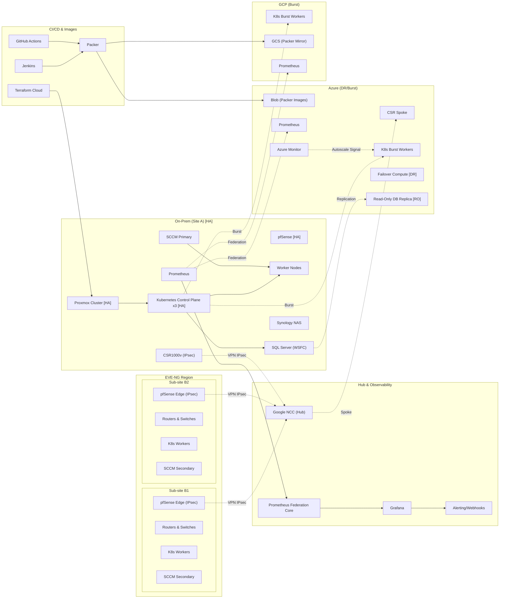

# HybridOps.Studio — Architecture Overview

**Summary**
**HybridOps.Studio is a product‑led hybrid blueprint spanning on‑prem Proxmox (with EVE‑NG sub‑sites) and Azure/GCP.**

> Looking for expert help with hybrid multicloud automation?
> See **[CONTRACTING.md](./CONTRACTING.md)** for services, packages, and contact details.

It delivers **DR ≤15 min**, cloud **read‑only DB**, and **burst‑to‑cloud Kubernetes** on demand.
A **policy‑governed Decision Service** chooses the failover/scale target in real time from telemetry, SLOs, and available credits, executed via **Terraform/Ansible/Packer** and **Jenkins/GitHub Actions** (observability: **Prometheus/Grafana**).

**Key Outcomes (KPIs)**
**RTO 15m · RPO 5m · Packer 12m · Terraform 10m · Autoscale +2@70% (scale‑in <40%)**

---

## Architecture Overview Diagram

<strong>🔎 Evidence Map (click to expand)</strong> — claim → proof links for KPIs & architecture

#### KPIs
- **RTO ≤ 15m** — [Grafana DR panel](#) · [Runbook step timings](#)
- **RPO ≤ 5m** — [SQL log shipping / AG graph](#)
- **Packer ≤ 12m** — [CI log: packer build](#)
- **Terraform ≤ 10m** — [CI log: terraform apply](#)
- **Autoscale +2@70% (scale-in <40%)** — [Alert → scale event trace](#)

#### Architecture Assertions
- **NCC hub-and-spoke** — [Topology / NCC routes](#)
- **Prometheus federation (on‑prem ↔ cloud)** — [Federation targets](#) · [Dashboards](#)
- **SQL WSFC → Azure RO** — [Replica status dashboard](#)
- **Packer → Blob / GCS (runtime images)** — [Artifact listings](#)
- **Decision Service (policy‑governed)** — [Repo section / policy file](#)

> Full, maintained list with screenshots and context: [`docs/EVIDENCE_MAP.md`](docs/evidence_map.md)

<strong>Fallback: Mermaid source (GitHub‑friendly)</strong>

---

## What / Why / How (at a glance)
- **What**: Hybrid blueprint spanning on‑prem (Proxmox), emulated sub‑sites (EVE‑NG), and public clouds (Azure, GCP).
- **Why**: Resilience (DR), elasticity (burst), and speed (image + infra pipelines) with verifiable KPIs.
- **How**: IaC + CI/CD; hub‑and‑spoke VPN via **Google NCC**; federated observability with **Prometheus/Grafana**; **policy‑driven Decision Service** informed by **Prometheus federation** and cloud monitor signals.

---

## Evidence (click‑to‑verify)

| Ref | Claim it proves                                 | Direct link |
|-----|--------------------------------------------------|-------------|
| E1  | Product‑led blueprint (architecture/tests)       | https://github.com/jeleel-muibi/hybridops.studio#architecture |
| E2  | Impact (DR/burst metrics, federation)            | # (Grafana panel URL) |
| E3  | Recognition (public automation roles)            | https://galaxy.ansible.com/HybriOps |
| E4  | Demo (talk + live failover)                      | # (YouTube URL) |

> Each link lands directly on proof (screens, runs, graphs).

---

## What’s Inside (concise)
- **On‑Prem (Proxmox)**: pfSense HA; Cisco CSR; K8s control‑plane (x3) + workers [HA]; SQL Server **WSFC**; SCCM; Synology NAS; Prometheus; **EVE‑NG nested**.
- **EVE‑NG (Sub‑Sites)**: Two emulated sites with pfSense edges (IPsec), routers/switches, K8s workers (join Site‑A CP), SCCM Secondary.
- **Cloud (Azure/GCP)**: CSR spoke (Azure); **K8s burst workers**; **DR** failover compute; **RO** database replica; Packer images (Blob/GCS); Prometheus; Azure/GCP Monitoring (signals).
- **Automation & Observability**: Terraform Cloud (plans/state); Jenkins & GitHub Actions; Packer (Windows + control node images); Ansible; Prometheus **federation**; Grafana; alerting/webhooks.

---

## Deep Dives (for engineers)
- [Inventories — single source of truth](./inventories/README.md)
- [Network Automation (Programmatic, Nornir)](./showcases/network-automation/programmatic-nornir/README.md)
- [Network Automation (Declarative, Ansible)](./showcases/network-automation/declarative-ansible/README.md)
- [Windows Automation](./windowsAutomation/README.md)
- [Linux Automation](./linuxAutomation/README.md)
- [Terraform Infra](./terraform-infra/README.md)
- [Server Automation](./serverAutomation/README.md)
- [Containerization](./containerization/README.md)
- [Pipeline Diagram](./docs/egf_pipeline.md)
- [Main Topology](./docs/topology_main.png)
- [Network Design](./docs/network-design.md)
- [Runbook & Deployment](./deployments/README.md)
- [SecOps Roadmap (Planned Upgrades)](./docs/guides/secops-roadmap.md)

---

## Licensing

- **Code (IaC, scripts, tooling):** MIT No Attribution (MIT‑0) — see [LICENSE](./LICENSE).
- **Docs & Diagrams (`docs/`):** Creative Commons Attribution 4.0 — see [docs/LICENSE-DOCS.md](./docs/LICENSE-DOCS.md).
- **Branding / Trademarks:** The **HybridOps.Studio** name/wordmark and third‑party vendor logos are **not** licensed — see [NOTICE](./NOTICE).

**Brand & Ownership**
© HybridOps.Studio — Designed by Jeleel Muibi · https://hybridops.studio

_Logos are trademarks of their respective owners. Use does not imply endorsement._

_Last updated: 2025-09-24 12:00 UTC_
