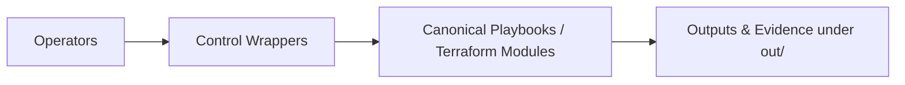

# Control — Operator Entry Points



Thin, reproducible entry points for day‑to‑day operations.  
These wrappers invoke canonical playbooks, Terraform, and GitOps manifests so runs are consistent across on‑premises and cloud targets.

> **Context:** Executed primarily from `ctrl‑01`, the zero‑touch control VM that orchestrates hybrid operations and drives evidence collection.

- **Scope:** orchestration wrappers, shared utilities, and decision logic used in DR/burst flows.  
- **Outputs:** human‑readable logs and artifacts under `out/` (created by `make env.setup`).

---

## Intended Audience

- **Operators** — perform DR tests, environment syncs, or bootstrap activities.  
- **Auditors** — verify reproducibility and evidence artefacts under `out/`.  
- **Contributors** — extend wrapper logic or improve orchestration consistency.

---

## Prerequisites

- **Runtime:** Python 3.10+, Terraform, Ansible, and GNU Make.  
- **Environment:** initialized using `make env.setup`.  
- **Configuration:** `.env` or environment variables defining `PROXMOX_HOST`, `CTRL_USER`, `SSH_KEY_PATH`, etc.

---

## Usage

Typical commands from `ctrl‑01` or local dev workstation:

```bash
make list              # Show available targets
make bootstrap.ctrl01  # Create or rebuild the control node
make dr.failover       # Trigger controlled failover
make dr.failback       # Return to on‑premise
make evidence.collect  # Generate JSON/CSV proof artifacts
```

Each command is idempotent, logged, and produces structured outputs under `out/artifacts/`.

---

## Conventions

- **Immutability:** no destructive actions by default; rollback always available.  
- **Evidence‑First:** every execution emits JSON/CSV proof.  
- **Consistency:** same flow for all environments (`dev`, `staging`, `prod`).  
- **Extensibility:** add new targets under `control/make/` or `control/scripts/`.  

---

## Related Documentation

- [Deployment Guide](../deployment/README.md)  
- [Terraform Infrastructure](../infra/README.md)  
- [Runbooks](../runbooks/README.md)  
- [Evidence Map](../docs/evidence_map.md)

---

**Maintainer:** Jeleel Muibi  
**Last Updated:** 2025‑10‑19 21:08 UTC  
**License:** MIT‑0 / CC‑BY‑4.0  
