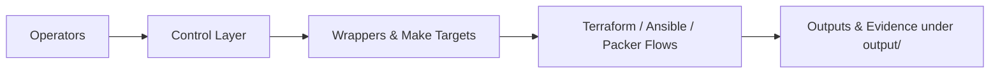

# Control — Operator Entry Points (Platform Repository)



Operator-facing entry points for day-to-day HybridOps.Studio platform operations.  
The control layer provides thin, reproducible wrappers around Ansible playbooks, Terraform modules, Packer builds, and related tooling so runs are consistent across on-premises and cloud targets.

> **Context:** Commands here are typically executed from `ctrl-01`, the automation controller that orchestrates hybrid operations and drives evidence collection.

- Scope: orchestration wrappers, shared utilities, and decision logic used in DR, burst, and baseline provisioning flows.  
- Outputs: human-readable logs and structured artifacts under the repository-level `output/` directory, suitable for auditors, assessors, and CI evidence.

---

## Directory Layout (high level)

```text
control/
├── bin/                  # Thin CLI wrappers for operators and CI
└── tools/                # Implementation grouped by concern
    ├── provision/        # Bootstrap + Packer tooling
    ├── setup/            # System prerequisites installers
    ├── jenkins/          # Jenkins controller, JCasC, CLI helpers
    ├── secrets/          # Secrets backends and bootstrap helpers
    ├── decision/         # Cost / DR / burst decision helpers
    ├── network/          # Network helper scripts
    ├── helper/           # Misc helpers (for example NetBox)
    ├── inventory/        # Inventory generation helpers
    └── etc/              # Local control-node configuration
```

This README intentionally shows only the top-level structure.  
Deeper trees (for example `providers/azure` under `decision/`, or `remote/` under `provision/packer`) are documented in README files inside those subdirectories.

---

## Execution Model

The control layer is designed so operators rarely call low-level tools directly.

- Primary interface: `make` targets defined in the repository root `Makefile` (and, where appropriate, thin shims in `control/bin`).  
- Consistency: targets delegate to wrapper scripts under `control/bin` or `control/tools` to keep parameters, logging, and evidence generation consistent.  
- Idempotency: control workflows are designed to be safe to re-run, particularly for DR rehearsals and CI pipelines.

Typical usage:

- Bootstrap a controller, lab environment, or CI agent.  
- Run image and template builds via Packer wrappers under `tools/provision`.  
- Apply or destroy infrastructure stacks via Terraform wrappers driven from the repo root.  
- Collect and archive evidence under `output/` (logs and artifacts) for later reference and linkage from documentation and showcases.

For an authoritative list of available commands, run from the repository root:

```bash
make help
```

and inspect `control/bin` and `control/tools` for the underlying implementations.

---

## System Prerequisites

System-level tooling (Terraform, Packer, kubectl, GitHub CLI, cloud CLIs, etc.) is installed via the `tools/setup` subtree.

- Installers and checks live under `control/tools/setup`.  
- They are designed to be idempotent and safe for use on both local machines and CI agents.
- Local overview: [tools/setup/README.md](./tools/setup/README.md) – system prerequisites installer overview.

Relevant references on the documentation site:

- [Platform prerequisites and tooling](https://docs.hybridops.studio/guides/getting-started/00-quickstart.md)
- [Environment setup and bootstrap flows](https://docs.hybridops.studio/getting-started/environment-setup/)

---

## Outputs and Evidence

All significant control workflows are expected to produce traceable output under the hybridops-platform repository root `output/` directory:

- `output/artifacts/` – machine-readable artifacts, reports, inventories, and evidence bundles.  
- `output/logs/` – raw tool logs (Packer, Terraform, Ansible, decision service, etc.).

This directory lives in the hybridops-platform repository, not in the docs repo. It is the canonical evidence area for operational runs.

The documentation site does not duplicate these artifacts; it explains and links to them where appropriate, for example:

- [Evidence and outputs overview](https://docs.hybridops.studio/evidence/overview/)
- [Platform run outputs and pipelines](https://docs.hybridops.studio/evidence/platform-runs/)

---

## Related Documentation

Additional material lives on the documentation site [docs.hybridops.studio](https://docs.hybridops.studio) (backed by the private `platform-docs` repository):

- [Deployment and environment guides](https://docs.hybridops.studio/guides/deployment-and-environments/)  
- [Terraform, Ansible, and Kubernetes how-to material](https://docs.hybridops.studio/howtos/infra-automation/)  
- [Runbooks and incident / DR procedures](https://docs.hybridops.studio/runbooks/)  
- [Evidence map and showcases](https://docs.hybridops.studio/evidence/map-and-showcases/)

---

**Maintainer:** HybridOps.Studio  
**Last Updated:** 2025-12-11  
**License:** MIT-0 for code, CC-BY-4.0 for documentation unless otherwise stated.
