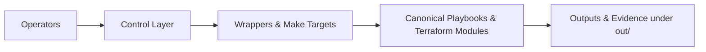

# Control — Operator Entry Points



Operator-facing entry points for day-to-day HybridOps.Studio operations.  
The control layer provides thin, reproducible wrappers around canonical Ansible playbooks, Terraform modules, and related tooling so runs are consistent across on-premises and cloud targets.

> **Context:** Commands here are typically executed from `ctrl-01`, the automation controller that orchestrates hybrid operations and drives evidence collection.

- **Scope:** orchestration wrappers, shared utilities, and decision logic used in DR, burst, and baseline provisioning flows.  
- **Outputs:** human-readable logs and artifacts under the repository-level `out/` directory (created on demand), suitable for auditors, assessors, and CI evidence.

---

## Directory Layout

```text
control/
├── Makefile        # Top-level operator targets
├── setup/          # System prerequisites installers (Terraform, Packer, kubectl, cloud CLIs)
└── tools/          # Provisioning, docs, and CI helper tooling
```

- `Makefile` exposes stable operator commands (e.g. environment setup, docs pipeline, and selected infrastructure workflows).  
- `setup/` contains system prerequisites installers and validation logic for core tooling. See the dedicated setup README for details.  
- `tools/` hosts implementation scripts and wrappers (e.g. Packer/Terraform/Ansible runners, documentation generators).  

Evidence and logs produced by these workflows are written to the repository root `out/` directory (or its predecessor `output/` in earlier revisions).

---

## Execution Model

The control layer is designed so operators rarely call low-level tools directly.

- **Primary interface:** `make` targets defined in `control/Makefile`.  
- **Consistency:** each target delegates to a wrapper script under `tools/` or `setup/` to keep parameters, logging, and evidence generation consistent.  
- **Idempotency:** control workflows are designed to be safe to re-run, particularly for DR rehearsals and CI pipelines.

Typical patterns:

- Bootstrap an environment (e.g. controller, lab, or CI agent).  
- Run image/template builds via Packer wrappers.  
- Apply or destroy infrastructure stacks via Terraform wrappers.  
- Trigger documentation builds and index generation for ADRs, runbooks, and how-to guides.  
- Collect and archive evidence under `out/` for later reference.

For an authoritative list of available commands, run:

```bash
cd control
make help
```

(if implemented) or inspect `Makefile` directly.

---

## System Prerequisites

System-level tooling (Terraform, Packer, kubectl, GitHub CLI, and cloud CLIs) is installed via the `setup/` subtree.

- Installers and checks live under `control/tools/setup/`.  
- They are designed to be idempotent and safe for use on both local machines and CI agents.  
- For a detailed breakdown of tools, versions, and verification commands, see:

- [Setup: System Prerequisites Installer](./setup/README.md)  
- [Global Prerequisites Guide](../docs/prerequisites/PREREQUISITES.md)

---

## Outputs and Evidence

All significant control workflows are expected to produce traceable output under the repository root `out/` directory, for example:

- Tool versions and environment snapshots.  
- Packer and Terraform logs with timestamps.  
- Generated reports, manifests, and checksums.  
- Links or pointers to external dashboards (Grafana, CI runs) where applicable.

`out/` is treated as a working evidence area and should remain excluded from version control, with curated artifacts promoted into the main documentation and proof trees as needed.

---

## Related Documentation

- [Deployment Guide](../deployment/README.md)  
- [Terraform Infrastructure](../infra/README.md)  
- [Runbooks](../runbooks/README.md)  
- [Evidence Map](../docs/evidence_map.md)

---

**Maintainer:** Jeleel Muibi  
**Last Updated:** 2025-11-23  
**License:** MIT-0 / CC-BY-4.0
