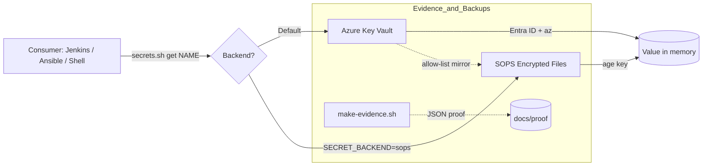

# HybridOps Studio — Secrets Management (per ADR-0015)

Implements [ADR-0015](../../../docs/adr/ADR-0015_secrets-strategy_akv-now_sops-fallback_vault-later.md): AKV-first with a selective SOPS fallback. Provides a single, safe CLI for pipelines and services.

- **Primary backend:** Azure Key Vault (AKV)
- **Fallback backend:** SOPS-encrypted files (offline/bootstrap)
- **Abstraction:** `secrets.sh` selects the backend transparently



---

## 1) Quick Start (Day‑0 friendly)

**Install tools:** `az`, `sops`, `age`, `bash`

**Configure:** create a private `.env`:
```bash
cd control/tools/secrets
cp env.example .env && chmod 600 .env
# minimally set:
# AZURE_TENANT_ID=...
# AZURE_SUBSCRIPTION_ID=...
# AZURE_CLIENT_ID=...
# AZURE_CLIENT_SECRET=...
# AZURE_KEYVAULT_URL=https://<kv-name>.vault.azure.net   # or DEFAULT_VAULT_NAME=<kv-name>
```

**(Once) Initialize SOPS:**
```bash
./backends/akv/setup-sops.sh
```

**Get a secret (AKV):**
```bash
./secrets.sh get jenkins-admin-password
```

**Fallback read (SOPS):**
```bash
SECRET_BACKEND=sops ./secrets.sh get jenkins-admin-password
```

**Selective backup AKV → SOPS:**
```bash
./secrets.sh backup jenkins          # obeys backup-allowlist.txt / prefixes
```

**Seed a bootstrap secret (pre‑CI):**
```bash
KV_NAME=<kv-name> SECRET_VALUE='<StrongPW>' bash control/tools/secrets/bootstrap/seed-akv.sh
```

**Generate reviewer evidence (no secret values):**
```bash
ENV=staging CLOUD=azure STACK="10-platform/keyvault" bash control/tools/secrets/bootstrap/make-evidence.sh
```

---

## 2) Usage Patterns

### In shell scripts
```bash
set +x
ADMIN_PASS="$(./secrets.sh get jenkins-admin-password)"
export ADMIN_PASS
# ...use it...
unset ADMIN_PASS
```

### In Jenkins
```groovy
sh '''
  set +x
  ADMIN_PASS="$(control/tools/secrets/secrets.sh get jenkins-admin-password)"
  export ADMIN_PASS
  # use ADMIN_PASS...
  unset ADMIN_PASS
'''
```

---

## 3) Conventions

- **Namespacing:** service prefixes (e.g., `jenkins-`, `netbox-`, `k8s-`).  
- **Environments:** separate vaults or namespaced keys (e.g., `prod/netbox-db-password`).  
- **Selective mirroring:** keep `backup-allowlist.txt` conservative; mirror only what’s needed offline.

---

## 4) Security Notes

- **AKV:** RBAC‑only, soft‑delete + purge protection, network restrictions where applicable.  
- **SOPS:** age private keys stored **outside** the repo, `0600` permissions.  
- **No plaintext:** commit **only encrypted** files under `backups/`; mask logs (`set +x`).  
- **Zero‑touch:** retrieve at runtime; do not paste secrets into CI or IaC code.

---

## 5) Troubleshooting

- **`az` auth error** → verify SP / workload‑identity env and `az account set`.  
- **Not found** → check exact secret name and active backend (`SECRET_BACKEND`).  
- **SOPS decrypt fail** → ensure correct age key is available & readable.  
- **Permissions** → scripts are executable; tools present on PATH.

---

## 6) Maintenance

- Rotate secrets per policy; refresh mirrored SOPS entries accordingly.  
- Periodically run `make-evidence.sh` and review outputs under `docs/proof/`.  
- Test restore with SOPS keys on a non‑prod host.

---

### Appendix — Minimal `.env` template

```dotenv
# Azure (non-interactive)
AZURE_TENANT_ID=
AZURE_SUBSCRIPTION_ID=
AZURE_CLIENT_ID=
AZURE_CLIENT_SECRET=

# Vault (either URL or name)
AZURE_KEYVAULT_URL=
# DEFAULT_VAULT_NAME=

# Backend selection (default akv)
# SECRET_BACKEND=akv
# SOPS_AGE_KEY_FILE=~/.config/sops/age/keys.txt
# SOPS_CONFIG=./.sops.yaml
```
