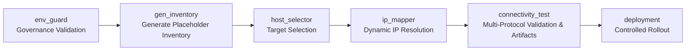

# Connectivity Test Role

**Enterprise-grade network validation with governance integration**

[](https://opensource.org/licenses/MIT-0)
[](https://ansible.com)

**Author:** jeleel-muibi | **Updated:** 2025-09-09 21:28:08 UTC | **Version:** 1.1.3

---

## Overview

Connectivity validation across ICMP, SSH, Telnet, HTTP, and HTTPS protocols. Integrates with governance frameworks and generates structured JSON and JSONL reports.

## Features

- Multi-protocol testing: ICMP, SSH, Telnet, HTTP, HTTPS
- Governance integration: env_guard + ip_mapper
- Structured reporting: JSON, JSONL
- CI/CD compatible: artifact generation and validation gates

## Pipeline Integration

```yaml
env_guard → gen_inventory → host_selector → ip_mapper → connectivity_test → deployment
```

### EGF Pipeline Flow



## Default Test Inventory (No Real Devices Required)

```ini
[test_targets]
localhost ansible_host=127.0.0.1 ansible_connection=local
google-dns ansible_host=8.8.8.8 ansible_connection=local
github-web ansible_host=140.82.112.3 ansible_connection=local

[unreachable_targets]
invalid-host ansible_host=192.0.2.1 ansible_connection=local
timeout-host ansible_host=10.255.255.1 ansible_connection=local

[all_test_hosts:children]
test_targets
unreachable_targets

[all_test_hosts:vars]
ansible_python_interpreter=auto_silent
```

## Testing

```bash
# Run isolated test harness
ansible-playbook -i roles/common/connectivity_test/tests/inventory/test_inventory.ini   roles/common/connectivity_test/tests/test_role.yml
```

Artifacts:
- `test_logs/test_connectivity_<timestamp>.json`
- `test_logs/test_connectivity_<timestamp>.jsonl`

## Usage

```yaml
- hosts: production_servers
  vars:
    validated_env: prod
    correlation_id: egf-20250909-01
    log_directory: "/var/logs/connectivity"
  roles:
    - common/connectivity_test
```

> If using placeholder IPs from gen_inventory, run ip_mapper before connectivity_test. If real IPs are provided, connectivity_test works standalone.

## CI/CD Integration

```yaml
- name: Run connectivity test
  run: |
    ansible-playbook -i inventories/prod/test_inventory.ini playbooks/connectivity.yml       -e validated_env=prod -e correlation_id=egf-20250909-01

- name: Upload artifacts
  uses: actions/upload-artifact@v4
  with:
    name: connectivity-artifacts
    path: logs/*
```

### CID Inheritance
The role tags results with a Correlation ID (CID) for traceability. CID is inherited with layered fallback:

1) `correlation_id` (playbook var) → 2) `egf_correlation_id` → 3) `EGF_CORR_ID` (env var), all lowercased.

```yaml
# defaults/main.yml
connectivity_use_cid: true
connectivity_inherited_cid: "{ correlation_id | default(egf_correlation_id | default('', true), true) | lower }"
connectivity_env_cid: "{ lookup('env','EGF_CORR_ID') | default('', true) | lower }"
connectivity_cid_pre: "{ connectivity_inherited_cid or connectivity_env_cid }"
```

## Dependencies

- [env_guard](../env_guard/)
- [gen_inventory](../gen_inventory/)
- [host_selector](../host_selector/)
- [ip_mapper](../ip_mapper/)
---

## Pipeline Context

This component is part of the Environment Guard Framework (EGF) pipeline.

For full pipeline flow and visuals, see:
- [docs/egf_pipeline.md](./docs/egf_pipeline.md)

Related roles:
- [env_guard](./common/env_guard/)
- [gen_inventory](./common/gen_inventory/)
- [host_selector](./common/host_selector/)
- [ip_mapper](./common/ip_mapper/)
- [connectivity_test](./common/connectivity_test/)

> Updated: 2025-09-10 11:20:00 UTC

---

**MIT-0 License** | [hybridops.studio](https://hybridops.studio) | **jeleel-muibi**
