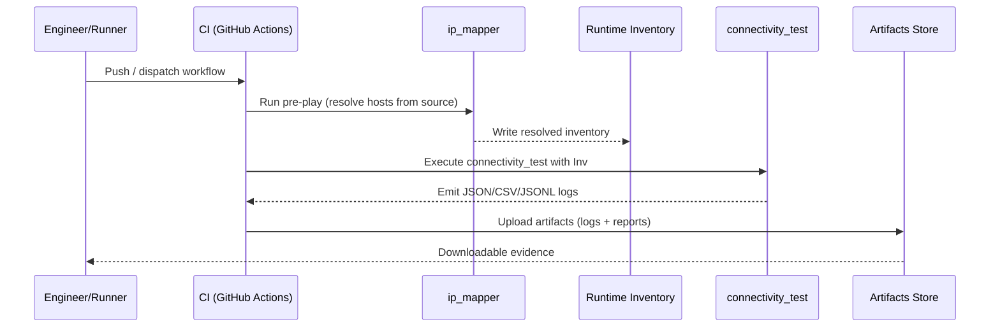

# Connectivity Files — 3 of 6
## Diagrams: Flow of IP Mapping → Connectivity Test → Artifact Storage

> Minimal, portfolio-ready visuals showing the preflight mapping, validation, and evidence capture path.

---

### 1) Mermaid Flowchart (GitHub renders this automatically)
```mermaid
flowchart LR
  classDef prefill fill:#E8F1FF,stroke:#1E62D0,stroke-width:1px,color:#0B2E6B;
  classDef validate fill:#E6FFED,stroke:#0A7D2E,stroke-width:1px,color:#064D1F;
  classDef evidence fill:#FFF4E5,stroke:#C76F00,stroke-width:1px,color:#5A3C00;

  A[hosts.ini\n(placeholders)]:::prefill --> B[ip_mapper\n(pre-play resolves)]:::prefill --> C[Runtime inventory\n(resolved hosts)]:::prefill
  C --> D[connectivity_test]:::validate
  D --> E[(test_logs/*.json)]:::evidence
  D --> F[(test_logs/*.csv)]:::evidence
  D --> G[(test_logs/*.jsonl)]:::evidence
  E --> H[[CI Artifacts\n(GitHub Actions)]]:::evidence
  F --> H
  G --> H

  subgraph "Governed Pipeline"
    direction LR
    A
    B
    C
    D
  end
```

---

### 2) Mermaid Sequence Diagram


---

### 3) ASCII (portable)
```
+------------------+       +-----------------------+       +------------------------------+
|  hosts.ini       |       |  ip_mapper (pre-play) |       |  Runtime inventory           |
|  (placeholders)  | ----> |  resolves hosts       | ----> |  (resolved hosts)            |
+------------------+       +-----------------------+       +------------------------------+
                                                              |
                                                              v
                                                     +---------------------+
                                                     |  connectivity_test  |
                                                     +----------+----------+
                                                                |
               +-----------------------+------------------------+------------------------+
               |                       |                         |                        |
               v                       v                         v                        v
      +-------------------+  +-------------------+      +-------------------+   +---------------------+
      | test_logs/*.json  |  | test_logs/*.csv   |      | test_logs/*.jsonl |   | CI Artifacts (GHA) |
      +---------+---------+  +---------+---------+      +---------+---------+   +----------+----------+
                \___________________________  _______________________________/               ^
                                            \/                                             /
                                      (Artifacts uploaded by CI)                          /
                                                                                          /
                                                            (Evidence available for download)
```

**Notes**
- Keep filenames stable for CI artifact collection (e.g., `test_logs/*.{json,csv,jsonl}`).
