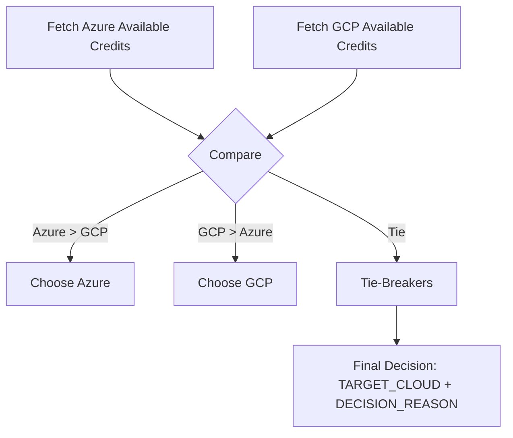

<!-- ============================================================= -->
# Decision Service – Credits‑Aware Cloud Selector

**Description:** Determines whether to fail over to Azure or GCP based on higher available credits, with thresholds and tie‑breakers.

**Author:** Jeleel Muibi
**Last Updated:** 2025-09-25

<!-- SPDX-License-Identifier: MIT -->
<!-- ============================================================= -->

## Decision Flow (Mermaid)


## Inputs
- `MIN_CREDIT` – minimum acceptable available credit (e.g., `50`).
- `CURRENCY` – normalization currency (e.g., `GBP`).
- Read‑only billing credentials for Azure & GCP.

## Outputs
- `TARGET_CLOUD=azure|gcp`
- `DECISION_REASON=<string>`

## Implementation Notes
- Stateless, idempotent; structured logs.
- Cache nightly metrics if API limits are tight.

---

## Implementation (Real Data Wiring)
You can wire **real credits** via multiple layers (from easiest to most robust):

1. **Environment overrides** (quick smoke test):
   ```bash
   export AZURE_AVAILABLE_CREDIT=120
   export GCP_AVAILABLE_CREDIT=80
   ```
2. **Prometheus textfile** (nightly exporter writes `decision/credits.prom`):
   ```text
   azure_available_credit 120
   gcp_available_credit 80
   ```
3. **Azure Cost + Grant** (enable live query):
   ```bash
   export ENABLE_AZURE_QUERY=1
   export AZ_SUBSCRIPTION_ID=<sub-id>
   export AZURE_CREDIT_GRANT=150  # your monthly credits in GBP
   ```
   The script uses `az costmanagement query` to get **Month-To-Date** cost and computes: `available = grant - cost`.
4. **GCP BigQuery Billing Export + Grant**:
   ```bash
   export ENABLE_GCP_BQ=1
   export GCP_BQ_TABLE=<project.dataset.table>   # billing export table
   export GCP_CREDIT_GRANT=150
   ```

### Run directly
```bash
python3 decision/credits_probe.py --min-credit 50 --currency GBP
```
Outputs:
```bash
export TARGET_CLOUD=azure
export DECISION_REASON=higher_credit
```

Then in Jenkins:
```groovy
sh 'eval "$(python3 decision/credits_probe.py --min-credit ${MIN_CREDIT} --currency GBP)"'
```
