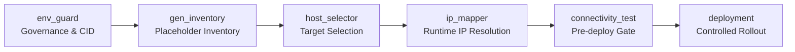

# Inventories — Single Source of Truth (SSOT)

**SPDX-License-Identifier: MIT-0**
**Project:** HybridOps.Studio · **Last Updated:** 2025-09-25 17:30 UTC

---

## Purpose
This directory is the **canonical, versioned source of truth** for automation targeting across sites and clouds. It defines **logical hosts and groups** and intentionally **excludes live IP addresses and secrets** from version control.

- Scope: on‑prem Proxmox (Site‑A), EVE‑NG sub‑sites (B1/B2), and Azure/GCP spokes.
- Consumers: Ansible playbooks/roles, Terraform modules, CI/CD pipelines, and runbooks.

---

## Security & Compliance Posture
- Host entries use **placeholder IPs** (`ansible_host=XX.XX.XX.00`).
- Real addressing and sensitive values are obtained **at runtime** from approved systems (e.g., Terraform outputs, Key Vault/Secret Manager/HashiCorp Vault, CMDB).
- Separation of duties is enforced by a governed pipeline; addressing appears **only after** policy gates pass.

---

## Role in the Automation Pipeline

The inventory participates in this pipeline to preserve least‑privilege and minimize exposure of addressing data.

---

## Directory Structure
```
core/ansible/inventories/
  ├── .inventory-root
  ├── dev/
  │   ├── hosts.ini            # generated at runtime (placeholders only)
  │   ├── group_vars/
  │   │   ├── all/
  │   │   │   ├── policy.yml          # KPIs & thresholds (non‑secret)
  │   │   │   ├── ip_addresses.yml    # runtime/vaulted source; no live IPs in Git
  │   │   │   └── secret.yml          # vaulted
  │   │   └── <role>.yml              # role‑specific vars (e.g., k8s_nodes.yml)
  │   └── host_vars/...
  ├── staging/  (links → dev group_vars/host_vars)
  └── prod/     (links → dev group_vars/host_vars)
```

---

## Example (placeholders only)
```ini
[cisco_routers]
coreR-1-Tok ansible_host=XX.XX.XX.00
coreR-2-Lag ansible_host=XX.XX.XX.00

[cisco_switches]
Asw-1-Tok  ansible_host=XX.XX.XX.00
Dst-1-Tok  ansible_host=XX.XX.XX.00
```
At runtime, the pipeline resolves token IPs to real addresses for the **approved scope** only.

---

## Policy thresholds (versioned, non‑secret)
```yaml
# core/ansible/inventories/dev/group_vars/all/policy.yml
policy:
  rto_minutes: 15
  rpo_minutes: 5
  autoscale:
    scale_out_threshold: 0.70
    scale_in_threshold: 0.40
  decision_weights:
    cost: 0.5
    latency: 0.3
    availability: 0.2
```

---

## Address Sources (runtime)
Addressing data is retrieved at runtime from one or more of:
- **Terraform outputs** (cloud): written to a runtime artifact, e.g. `core/ansible/runtime/ips/<env>.yml`
- **CMDB / inventory service** (on‑prem)
- **Cloud tag discovery** (AKS/GKE nodes, load balancers, firewalls)

Live IPs are not stored in the repository.

---

## References
- [Architecture Overview (PNG)](../../../docs/diagrams/flowcharts/renders/architecture-overview.png)
- [Network Design (Mermaid + narrative)](../../../docs/network-design.md)
- [Evidence Map (claims → proof)](../../../docs/EVIDENCE_MAP.md)

---

**MIT‑0 License** · © HybridOps.Studio (Jeleel Muibi)
