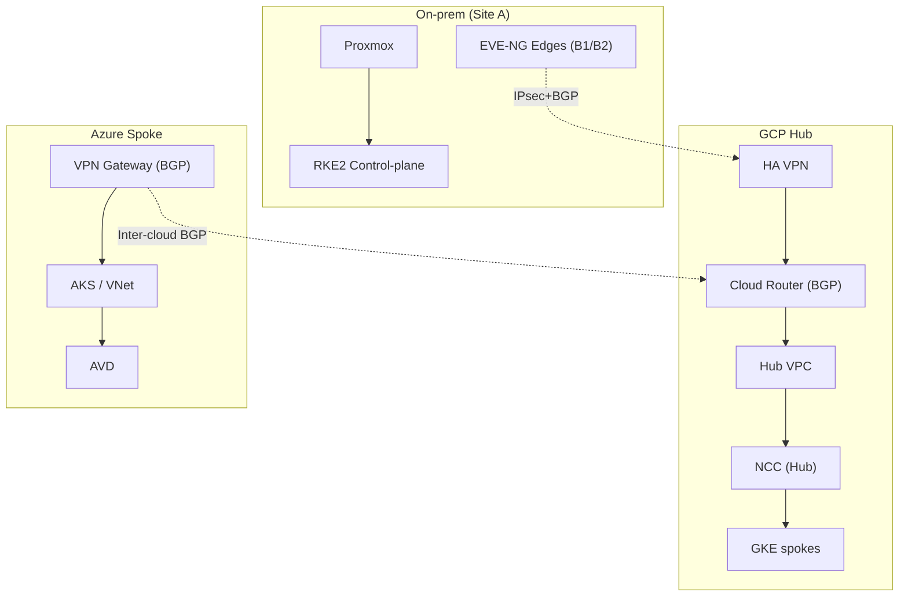
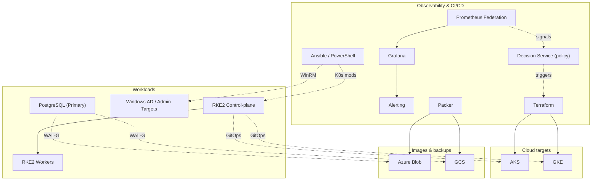

# Architecture Overview (Mermaid)

> **Navigate:** [Docs Home](../README.md) · [Network Design](../network/README.md)

## Network Core (Single Hub)
> **Legend:** solid = control/data · dotted = IPsec/BGP

---

## Operations & Workloads (Windows, GitOps, DR)
> **Legend:** solid = control/data · dotted = GitOps/Config/Backups/Signals

---
---

## See also
- **Security & Compliance (summary)** — see [Network Design › Security](../network/README.md#security--compliance-summary)
- **Test Matrix (minimum)** — see [Network Design › Test Matrix](../network/README.md#test-matrix-minimum)
- **Alternative Topology (Dual Hubs)** — see [Network Design › Appendix — Dual Hubs](../network/README.md#appendix--dual-hubs-reference)
