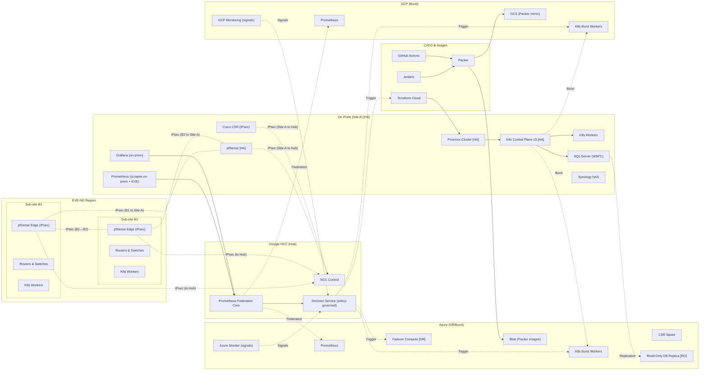

## Mermaid Diagram (renders on GitHub)
> **Legend:** Solid = control/data · Dashed = IPsec/eBGP

```mermaid
flowchart LR
  %% ===== On-Prem =====
  subgraph OnPrem["On-Prem (Site A) [HA]"]
    PVE["Proxmox Cluster [HA]"]
    PF["pfSense [HA]"]
    CSR["Cisco CSR (IPsec)"]
    KCP["K8s Control Plane x3 [HA]"]
    KW["K8s Workers"]
    SQL["SQL Server (WSFC)"]
    NAS["Synology NAS"]
    PROM_ON["Prometheus (scrapes on-prem + EVE)"]
    GRAF["Grafana (on-prem)"]
  end

  %% ===== EVE-NG Region =====
  subgraph EVE["EVE-NG Region"]
    subgraph B1["Sub-site B1"]
      PF_B1["pfSense Edge (IPsec)"]
      RSW_B1["Routers & Switches"]
      KW_B1["K8s Workers"]
    end
    subgraph B2["Sub-site B2"]
      PF_B2["pfSense Edge (IPsec)"]
      RSW_B2["Routers & Switches"]
      KW_B2["K8s Workers"]
    end
  end

  %% ===== Hub / Federation / Decision =====
  subgraph HUB["Google NCC (Hub)"]
    NCC["NCC Control"]
    PROM_CORE["Prometheus Federation Core"]
    DEC["Decision Service (policy-governed)"]
  end

  %% ===== Azure =====
  subgraph Azure["Azure (DR/Burst)"]
    CSR_AZ["CSR Spoke"]
    K8S_AZ["K8s Burst Workers"]
    RO_DB["Read-Only DB Replica [RO]"]
    DR_VM["Failover Compute [DR]"]
    AZ_MON["Azure Monitor (signals)"]
    PROM_AZ["Prometheus"]
    BLOB["Blob (Packer images)"]
  end

  %% ===== GCP =====
  subgraph GCP["GCP (Burst)"]
    K8S_GCP["K8s Burst Workers"]
    GCS["GCS (Packer mirror)"]
    PROM_GCP["Prometheus"]
    GCP_MON["GCP Monitoring (signals)"]
  end

  %% ===== CI/CD & Images =====
  subgraph CICD["CI/CD & Images"]
    JENK["Jenkins"]
    GHA["GitHub Actions"]
    PACK["Packer"]
    TFC["Terraform Cloud"]
  end

  %% ===== Primary (solid) flows =====
  PVE --> KCP
  KCP --> KW
  KCP --> SQL
  PROM_ON --> PROM_CORE
  GRAF --> PROM_CORE
  TFC --> PVE
  JENK --> PACK
  GHA --> PACK
  PACK --> BLOB
  PACK --> GCS

  %% ===== Overlays (dashed) =====
  PF -. "IPsec (Site-A to Hub)" .-> NCC
  CSR -. "IPsec (Site-A to Hub)" .-> NCC
  PF_B1 -. "IPsec (to Hub)" .-> NCC
  PF_B2 -. "IPsec (to Hub)" .-> NCC
  PF_B1 -. "IPsec (B1 to Site-A)" .- PF
  PF_B2 -. "IPsec (B2 to Site-A)" .- PF
  PF_B1 -. "IPsec (B1↔B2)" .- PF_B2

  PROM_CORE -. "Federation" .-> PROM_AZ
  PROM_CORE -. "Federation" .-> PROM_GCP
  KCP -. "Burst" .-> K8S_AZ
  KCP -. "Burst" .-> K8S_GCP
  SQL -. "Replication" .-> RO_DB

  AZ_MON -. "Signals" .-> DEC
  GCP_MON -. "Signals" .-> DEC
  PROM_CORE --> DEC

  DEC -. "Trigger" .-> K8S_AZ
  DEC -. "Trigger" .-> K8S_GCP
  DEC -. "Trigger" .-> DR_VM
  DEC -. "Trigger" .-> TFC
```
