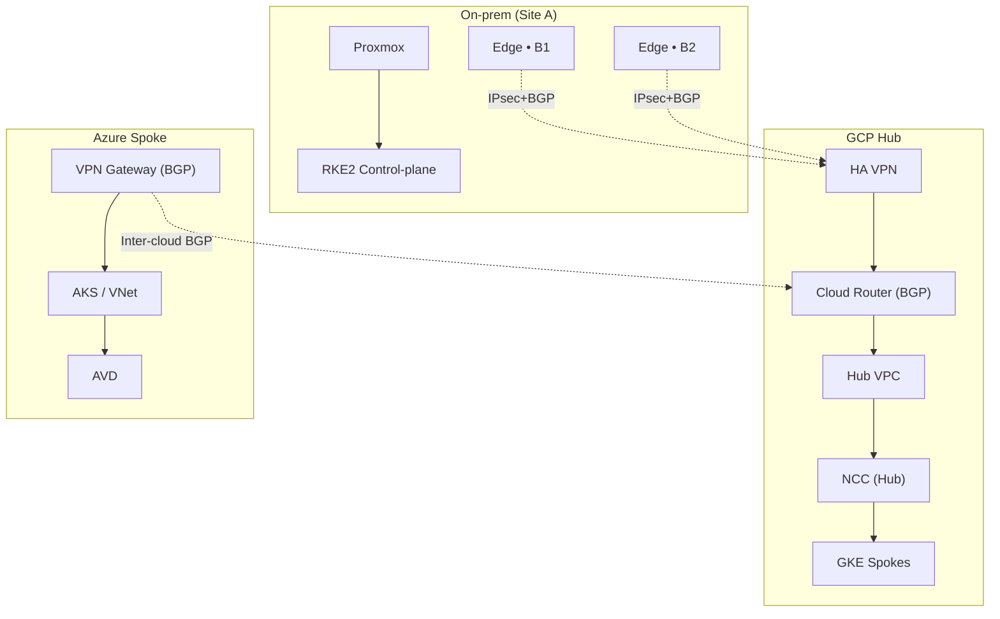
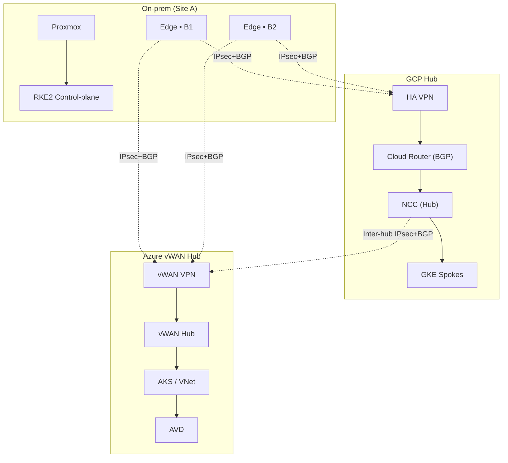

# Network Design
_Last updated: 2025‑10‑05 (UTC)_

> **Navigate:** [Docs Home](../../README.md) · [Architecture Overview](../mermaid/architecture-overview.md)

HybridOps.Studio uses a **single, central hub** for hybrid networking: **Google Network Connectivity Center (NCC)** in GCP.
On‑premises sites (including EVE‑NG sub‑sites) and Azure attach by **IPsec + BGP**, providing a clean, multi‑cloud fabric
for steady‑state operations and for DR/burst scenarios.

## Topology at a glance
- **On‑prem:** Proxmox core; EVE‑NG edges (B1/B2); RKE2 control plane/workers; PostgreSQL (primary).
- **Windows:** AD DS/DNS and admin targets on‑prem; **AVD** in Azure consumes private services via AKS/VNet.
- **Hub (GCP):** HA VPN → Cloud Router → Hub VPC → **NCC** → GKE spokes.
- **Azure:** VPN Gateway (BGP) → inter‑cloud IPsec/BGP to GCP Cloud Router → AKS/VNet.
- **Observability:** Prometheus Federation scrapes on‑prem + clouds; Grafana provides shared views.

> **Source of truth:** Prefixes/ASNs are rendered from Terraform + NetBox. No real IPs or secrets are committed to Git.

## Addressing & ASNs (illustrative)
- **ASNs:** Site‑A 65010 · B1 65011 · B2 65012 · GCP 64514 · Azure 65515
- **Kubernetes:** Pods `172.21.0.0/16` · Services `172.22.0.0/16`
- **Cloud workers:** Azure `10.60.0.0/16` · GCP `10.70.0.0/16`
- **DB segment (Azure RO if used):** `10.60.20.0/24`

> All values are parameterized and resolved at deploy time.

## Routing & HA
- **Tunnels:** Route‑based **IPsec (VTI)** from Site‑A and B1/B2 to **GCP HA VPN**; **BGP** on all VTIs.
- **Inter‑cloud:** **Azure VPN Gateway (BGP)** peers with **GCP Cloud Router**.
- **Internal:** OSPF/ISIS per site as needed; VRRP/HSRP/CARP on edges.
- **Policy:** Prefer on‑prem steady‑state; DR/burst steered by the Decision Service via Terraform/GitOps.

## Observability & decisioning
- **Federation core** (hub) scrapes on‑prem + AKS + GKE; cloud monitors (Azure Monitor / GCP Monitoring) provide signals.
- **Decision Service** evaluates SLOs and available credits and triggers scale/failover pipelines.

---

### Primary topology (single hub)
> **Legend:** solid = control/data · dotted = IPsec/BGP

  
<strong>Alternative topology (dual hubs: NCC + Azure vWAN)</strong> — click to expand

> **Legend:** solid = control/data · dotted = IPsec/BGP

---

## Security & compliance (summary)
- RBAC and GitOps drift control; secrets via Sealed/External Secrets with KMS.
- Backups with **WAL‑G** to Blob/GCS; RTO/RPO demonstrated in the Evidence Map.

## Test matrix (minimum)
- **VPN:** Site‑A↔GCP, B1↔GCP, B2↔GCP up; Azure↔GCP inter‑cloud up.
- **Routing:** BGP adjacencies established; Pod/Service CIDRs reachable across sites.
- **Segmentation:** Inter‑VRF isolation enforced; only approved routes leaked to Corp.
- **DR/Burst:** Policy flip sends new flows to AKS/GKE; RO DB reachable; latency within SLO.

## Evidence
- **NCC topology & attachments** — [Proof › NCC/vWAN](../../proof/ncc/images/)
- **Cloud Router & Azure BGP peers** — [Proof › Observability](../../proof/observability/images/)
- **DR/burst timelines (Grafana)** — [Proof › Observability](../../proof/observability/images/)
- **Traceroutes/site reachability** — [Proof › Misc assets](../../proof/others/assets/)

## Appendix — Dual Hubs (reference)

A symmetric variant adds **Azure Virtual WAN/Hub VNet** as a second hub with **inter‑hub BGP** to GCP NCC.

**When to consider**
- Regulated or sovereign workloads that require an Azure control‑plane anchor.
- Regional hairpin minimization when most consumers are Azure‑resident.
- Cross‑vendor resiliency drills (hub isolation/failover).

**Trade‑offs (baseline remains single hub)**
- Higher control‑plane cost and operational overhead (policy duplication, broader troubleshooting surface).
- More complex route policy and segmentation to avoid asymmetric paths.
- Longer change lead time (two hub toolchains to keep in lockstep).

**Prerequisites**
- Azure vWAN/Hub VNet with VPN/ExpressRoute and route tables.
- Inter‑hub IPsec/BGP (vWAN ↔ NCC/Cloud Router) with explicit route filtering.
- Clear placement for shared services (DNS, identity, egress).

**Evidence pointers**
- Azure vWAN topology & route tables — [Proof › NCC/vWAN](../../proof/ncc/images/)
- Inter‑hub BGP peer status & learned routes — [Proof › Observability](../../proof/observability/images/)
- Drill timings and path visuals — [Evidence Map](../../evidence_map.md)

---

## Related
- **Architecture Decision Record:** [ADR‑0004 — NCC as primary hub, Azure as routed spoke](../../adr/ADR-0004_ncc-primary-hub_azure-spoke.md)
- **SecOps Roadmap:** [SecOps Roadmap](../../guides/secops-roadmap.md)
- **Repository Home:** [README](../../../README.md)
