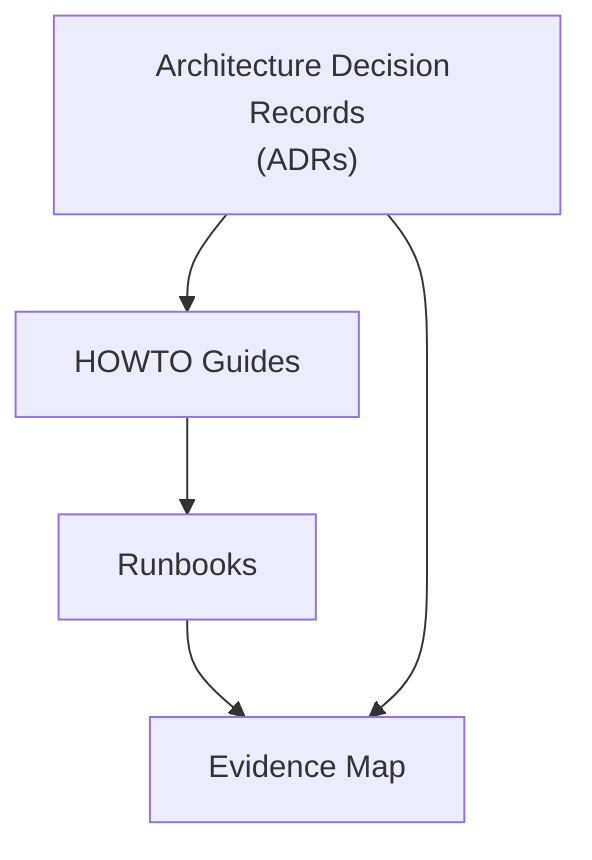

# HybridOps Studio — Documentation Index

This page orients readers to the core materials — ADRs (why), HOWTOs (how), Runbooks (operate), diagrams (design), and evidence. Detailed procedures live in the HOWTOs and Runbooks.

> This index omits shell commands and credentials. Use the HOWTOs and Runbooks for reproducible steps.

  
<strong>Documentation structure (click to expand)</strong>

<em>Decide → Implement → Operate → Prove</em>

---

## Start here

- **HOWTO: Provision the Control Node (Proxmox)** — Day-0 → Day-1 walkthrough with execution steps.  
  See: [HOWTO – Provision ctrl-01](./howto/HOWTO_ctrl01_provisioner.md)

- **Design rationale** — why the control node is a full VM (cloud-init) and how this supports DR and migration.  
  See: [ADR-0012 — Control node as a VM](./adr/ADR-0012_control-node-as-vm.md)

- **Operations runbook** — verification, optional Jenkins notes, troubleshooting, and re-runs.  
  See: [Runbook — ctrl-01 bootstrap](./runbooks/bootstrap/bootstrap-ctrl01-node.md) · [Evidence — ctrl-01 bootstrap](./proof/ctrl01/latest/README.md)

---

## Highlights

- Zero-touch control plane: Provisions Jenkins controller (`ctrl-01`) on Proxmox in ≈10 minutes via cloud-init Day-0/Day-1 automation — fully Git-driven and evidence-backed.  
- Source of truth: NetBox-driven inventory with Ansible dynamic discovery.  
- GitOps everywhere: Argo CD / Flux manage desired state across clusters; Rancher optional for fleet access.  
- Resilient data: PostgreSQL authoritative on-prem; WAL-G backups to cloud storage; fast promotion for DR.  
- Networking backbone: Google Network Connectivity Center (NCC) as hub; on-prem and cloud VNets/VPCs as spokes.  
- Observability first: Prometheus Federation across sites; shared Grafana views.  
- Policy-driven DR/burst: Decision Service evaluates federation metrics + Azure/GCP monitor signals + available credits.  
- Operator workflow: No click-ops — Make, Terraform, Ansible, and shell wrappers power everything.  
- Evidence-backed: Every claim maps to logs, outputs, screenshots, or dashboards.  

**Target KPIs:** RTO ≤ 15 m · RPO ≤ 5 m · Packer ≤ 12 m · Terraform ≤ 10 m · Autoscale +2 @ 70% (scale-in < 40%).

---

## Selected artifacts

- **Briefings**
  - [Executive Summary](./briefings/executive_summary.md)
  - [Project Overview](./briefings/project_overview.md)
  - [Technical Architecture](./briefings/technical_architecture.md)

- **HOWTOs & Runbooks**
  - [HOWTO Library](./howto/README.md)
  - [Runbook Index](./runbooks/README.md)
  - Direct: [ctrl-01 — Bootstrap & verification](./runbooks/bootstrap/bootstrap-ctrl01-node.md)  
    DR: [Failover to cloud](./runbooks/dr/dr-failover-to-cloud.md) · [Failback to on-prem](./runbooks/dr/dr-failback-to-onprem.md) · [DNS cutover](./runbooks/ops/ops-dns-cutover.md)  
    Bootstrap: [RKE2 install](./runbooks/bootstrap/bootstrap-rke2-install.md) · [NetBox seed](./runbooks/bootstrap/bootstrap-netbox.md)

- **ADRs**
  - [ADR Index](./adr/README.md)  
    Selected: [ADR-0001 — ADR process](./adr/ADR-0001-adr-process-and-conventions.md) · [ADR-0002 — NetBox SoT](./adr/ADR-0002_source-of-truth_netbox-driven-inventory.md) · [ADR-0003 — Secrets via External Secrets + KMS](./adr/ADR-0003_secrets-management_k8s-external-secrets-kms.md) · [ADR-0012 — Control node as a VM](./adr/ADR-0012_control-node-as-vm.md)

- **Diagrams**
  - [Architecture (rendered)](./diagrams/flowcharts/renders/architecture-overview.png)
  - [Architecture (Mermaid)](./diagrams/mermaid/architecture-overview.md)
  - [Network design (canonical)](./diagrams/network/README.md)

- **Evidence & Proof**
  - [Evidence Map (claims → proofs)](./evidence_map.md)
  - [Proof Archive](./proof/README.md)

- **Cost & Telemetry**
  - Guide: [Cost & Telemetry](./guides/cost-model.md)  
  - Evidence: [Proof → cost](./proof/cost/)  
  - Policy hooks: [Decision Service](../control/decision/)

- **CI**
  - [CI overview](./ci/README.md) · [GitHub Actions](./ci/github-actions.md) · [Jenkins CI](./ci/jenkins.md)

- **Guides & Roadmaps**
  - [SecOps Roadmap](./guides/secops-roadmap.md)
  - [Maintenance Guide](./maintenance.md)

---

## Conventions

- This page is an index of portfolio artifacts.  
- Execution details: HOWTOs and Runbooks.  
- Design decisions: ADRs.  
- Evidence and proofs: Evidence Map and Proof Archive.

---

Last updated: 2025-10-20
