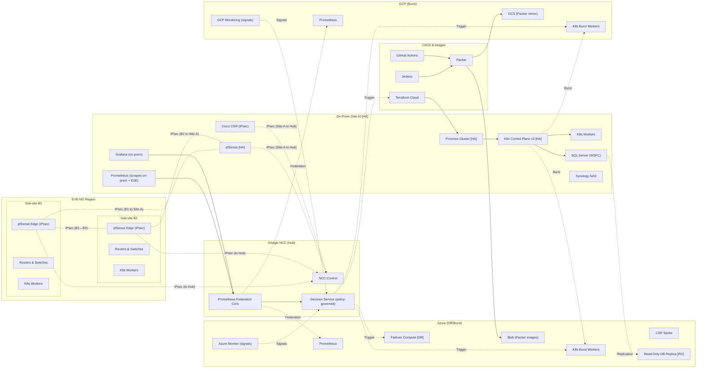

# Network Design — HybridOps.Studio
_Last updated: 2025-09-21 19:53 UTC_

This document describes the **hub-and-spoke hybrid network** for HybridOps.Studio: an on-prem Proxmox core (hosting EVE-NG sub-sites **B1/B2**) connected via **Google NCC (hub)** to **Azure** and **GCP** spokes. It supports **DR/burst**, **policy-driven routing**, and **federated observability** while keeping real addresses out of Git.

---

## Addressing & ASNs (illustrative)
- **ASNs:** Site-A **65010** · B1 **65011** · B2 **65012** · NCC **65000** · Azure **65020** · GCP **65030**
- **K8s (on-prem):** Pods **172.21.0.0/16**, Services **172.22.0.0/16**
- **Cloud workers:** Azure **10.60.0.0/16** · GCP **10.70.0.0/16**
- **RO DB (Azure):** **10.60.20.0/24**
- **Segmentation:** VRFs: **Transit**, **Corp**; VLANs: **10 App**, **20 DB**, **30 Mgmt**

> Addresses are placeholders. Real IPs are resolved at runtime by the pipeline.

---

## Routing, VPN, and HA
- **VPN:** Route-based **IPsec VTI** between each site (Site-A, B1, B2) and **NCC hub**.
- **Dynamic routing:** **eBGP** on all IPsec VTIs; **OSPF** internally in each site.
- **HA:** pfSense/Cisco HA at edges; VRRP/HSRP/CARP as appropriate; STP on L2 segments.
- **Policy controls:** Prefer on-prem for steady-state; burst/failover steered via **BGP communities** / **local-pref**.
- **North-south:** Egress governed by NCC policies; east-west via Transit VRF with route filters.

---

## Observability & Decisioning
- **Prometheus (on-prem)** scrapes on-prem + EVE sub-sites; exports to **Prometheus Federation Core**.
- **Cloud signals:** Azure Monitor / Google Cloud Monitoring supplement federation for burst/DR triggers.
- **Decision Service:** Consumes metrics + SLOs + credit/cost signals; triggers **CI/CD** to scale or fail over.

---

## Test Matrix (minimum)
- **VPN:** IPsec up on Site-A↔NCC, B1↔NCC, B2↔NCC; Azure/GCP spokes up.
- **Routing:** eBGP adjacencies established; route exchange for K8s Pods/Services and RO DB.
- **Segmentation:** Inter-VRF isolation enforced; only approved Transit routes leaked to Corp.
- **DR/Burst:** Policy flip sends new flows to Azure/GCP workers; RO DB reachable; latency within SLO.

---

## Mermaid Diagram (renders on GitHub)
> **Legend:** Solid = control/data · Dashed = IPsec/eBGP

