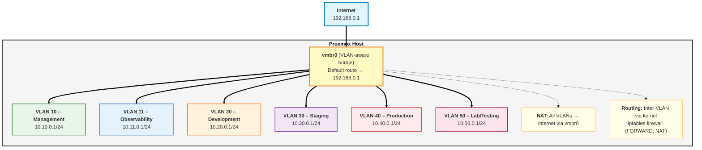

# Network Architecture

HybridOps.Studio uses VLAN-based segmentation with the Proxmox host acting as the **intra-site Layer 3 core**.This document describes the topology, IP allocation strategy, and operational patterns that support the **HybridOps.Studio enterprise-style hybrid cloud blueprint**.

Within the on-prem “site”, Proxmox terminates VLAN gateways, routes between internal segments, and performs NAT towards the upstream LAN router.Edge connectivity — dual ISP, WAN routing, and VPNs/tunnels to public cloud and simulated remote sites — is provided by dedicated virtual edge routers (CSR/VyOS) running in EVE-NG, as defined in:

- [ADR-0106 – Dual ISP Load Balancing for Resiliency](../adr/ADR-0106-dual-isp-load-balancing-resiliency.md)
- [ADR-0107 – VyOS as Cost-Effective Edge Router](../adr/ADR-0107-vyos-edge-router.md)
- [ADR-0108 – Full Mesh Topology for High Availability](../adr/ADR-0108-full-mesh-ha-topology.md)

This separation mirrors a typical enterprise design:

- **Core / aggregation:** Proxmox L3 core and VLAN gateways ([ADR-0101](../adr/ADR-0101-vlan-allocation-strategy.md), [ADR-0102](../adr/ADR-0102-proxmox-intra-site-core-router.md), [ADR-0103](../adr/ADR-0103-inter-vlan-firewall-policy.md), [ADR-0104](../adr/ADR-0104-static-ip-allocation-terraform-ipam.md))  
- **Edge / WAN:** VyOS/CSR routers for ISP, cloud and site-to-site connectivity ([ADR-0106](../adr/ADR-0106-dual-isp-load-balancing-resiliency.md), [ADR-0107](../adr/ADR-0107-vyos-edge-router.md), [ADR-0108](../adr/ADR-0108-full-mesh-ha-topology.md), [ADR-0201](../adr/ADR-0201-eve-ng-network-lab-architecture.md))  
- **Observability:** Dedicated observability VLAN and stack (Prometheus, Grafana, Loki) as described in [ADR-0401 – Unified Observability with Prometheus](../adr/ADR-0401-unified-observability-with-prometheus.md).

For detailed design decisions, see:

- [ADR-0101 – VLAN Allocation Strategy](../adr/ADR-0101-vlan-allocation-strategy.md)
- [ADR-0102 – Proxmox as Intra-Site Core Router](../adr/ADR-0102-proxmox-intra-site-core-router.md)
- [ADR-0103 – Inter-VLAN Firewall Policy](../adr/ADR-0103-inter-vlan-firewall-policy.md)
- [ADR-0104 – Static IP Allocation with Terraform IPAM](../adr/ADR-0104-static-ip-allocation-terraform-ipam.md)
- [ADR-0105 – Dual Uplink Design (Ethernet/WiFi Failover)](../adr/ADR-0105-dual-uplink-ethernet-wifi-failover.md)
- [ADR-0201 – EVE-NG Network Lab Architecture](../adr/ADR-0201-eve-ng-network-lab-architecture.md)
- [ADR-0401 – Unified Observability with Prometheus](../adr/ADR-0401-unified-observability-with-prometheus.md)

---

## Topology Overview



High-level placement:

- Management plane (VLAN 10) – bastion, Ansible controller, Terraform state (future).
- Observability (VLAN 11) – Prometheus, Grafana, Loki.
- Development, staging, production (VLAN 20/30/40) – Kubernetes clusters and workloads.
- Lab/Testing (VLAN 50) – EVE-NG and experimental VMs.

---

## VLAN Allocation

| VLAN | Subnet        | Gateway    | Purpose        | Firewall Policy (summary)          |
|------|---------------|-----------|----------------|------------------------------------|
| 10   | 10.10.0.0/24  | 10.10.0.1 | Management     | Can reach all VLANs                |
| 11   | 10.11.0.0/24  | 10.11.0.1 | Observability  | Read-only scraping into workloads  |
| 20   | 10.20.0.0/24  | 10.20.0.1 | Development    | Isolated from staging/production   |
| 30   | 10.30.0.0/24  | 10.30.0.1 | Staging        | Limited read from production       |
| 40   | 10.40.0.0/24  | 10.40.0.1 | Production     | Fully isolated from non-production |
| 50   | 10.50.0.0/24  | 10.50.0.1 | Lab/Testing    | Fully isolated                     |
| 60–99| Reserved      | TBD        | Future use     | TBD                                |

Design principles:

- 10–19: management plane.
- 20–29: development.
- 30–39: staging.
- 40–49: production.
- 50–59: lab/testing.

Detailed reasoning is captured in [ADR-0101 – VLAN Allocation Strategy](../adr/ADR-0101-vlan-allocation-strategy.md).

---

## IP Allocation

Per VLAN:

- `.1` – gateway (Proxmox bridge IP).
- `.2–.9` – infrastructure services (DNS, DHCP future use, proxies, etc.).
- `.10–.250` – VM allocation pool managed by Terraform IPAM.
- `.251–.254` – reserved for special cases.

IP allocation is managed via a Terraform IPAM module that:

- Allocates static IPs from per-VLAN ranges.
- Stores allocations in Terraform state for conflict prevention.
- Exposes addresses and gateway information as module outputs for VM modules.
- Drives cloud-init configuration for static IPs.

Implementation details are captured in [ADR-0104 – Static IP Allocation with Terraform IPAM](../adr/ADR-0104-static-ip-allocation-terraform-ipam.md).

---

## Routing and NAT

The Proxmox host performs Layer 3 routing between VLANs (see [ADR-0102 – Proxmox as Intra-Site Core Router](../adr/ADR-0102-proxmox-intra-site-core-router.md)).

- Routing: Linux kernel routing table.
- NAT: `iptables` `POSTROUTING` rules for each VLAN, for example:

```bash
iptables -t nat -A POSTROUTING -s '10.20.0.0/24' -o vmbr0 -j MASQUERADE
```

- IP forwarding enabled via `net.ipv4.ip_forward=1`.

---

## Firewall Policy (Inter-VLAN)

Inter-VLAN traffic is controlled via `iptables` in the `FORWARD` chain with a default-deny posture.Key aspects (see [ADR-0103 – Inter-VLAN Firewall Policy](../adr/ADR-0103-inter-vlan-firewall-policy.md)):

- Management VLAN can reach all environments (restricted ports).
- Observability VLAN can scrape metrics from workloads on defined ports.
- Production cannot initiate connections into development, staging, or lab.
- Lab VLAN is fully isolated (no traffic in or out).

Firewall rules are managed via an Ansible role under `infra/ansible/roles/proxmox-firewall` (planned).

---

## Uplink Failover

The Proxmox host supports two uplink options:

- `enp87s0` – primary Ethernet.
- `wlp89s0` – secondary WiFi.

Configuration in `/etc/network/interfaces` allows manual failover by switching which `vmbr0` stanza is active, while VLAN subinterfaces remain unchanged.The design is documented in [ADR-0105 – Dual Uplink Design (Ethernet/WiFi Failover)](../adr/ADR-0105-dual-uplink-ethernet-wifi-failover.md).

---

## Lab and EVE-NG

EVE-NG runs in the Lab VLAN (VLAN 50) as **parallel infrastructure** rather than inline routing.This avoids putting lab experiments in the production path while still enabling realistic network simulations.

The rationale and usage patterns are documented in [ADR-0201 – EVE-NG Network Lab Architecture](../adr/ADR-0201-eve-ng-network-lab-architecture.md).

---

## Observability

A single Prometheus instance in VLAN 11 provides unified observability across all environments, with Grafana dashboards and Loki for logs.

For details, see [ADR-0401 – Unified Observability with Prometheus](../adr/ADR-0401-unified-observability-with-prometheus.md).

---

## Validation Checklist

On the Proxmox host:

```bash
# VLAN-aware bridge present
ip link show vmbr0

# VLAN subinterfaces present
ip addr show | grep 'vmbr0.'

# Routes per VLAN
ip route | grep vmbr0

# NAT rules present
iptables -t nat -L POSTROUTING -n -v
```

From representative VMs:

```bash
# Gateway reachability
ping 10.20.0.1

# Internet reachability
ping 8.8.8.8

# Isolation checks (e.g.dev → prod should fail)
ping 10.40.0.10
```

Detailed operational procedures and troubleshooting steps will be captured as runbooks under `docs/runbooks/networking/`.

---

**Maintainer:** HybridOps.Studio  
**License:** MIT-0 for code, CC-BY-4.0 for documentation unless otherwise stated.
