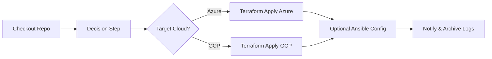

<!-- ============================================================= -->
# Jenkins – Orchestrated Failover Pipeline

**Description:** Runs Decision → (optional) Packer publish → Terraform apply to the chosen cloud.

**Author:** Jeleel Muibi
**Last Updated:** 2025-09-25

<!-- SPDX-License-Identifier: MIT -->
<!-- ============================================================= -->

## Pipeline Flow (Mermaid)

## Stages (suggested)
1. **Checkout** repository.
2. **Decide Target Cloud**: run `decision/` tool; export `TARGET_CLOUD`.
3. **Fetch Latest Image**: VHD SAS (Azure) / image name (GCP).
4. **Provision**: `terraform init/plan/apply` in chosen subfolder.
5. (Optional) **Configure**: run Ansible.
6. **Notify** and archive artifacts (logs, state summaries).

## Credentials & Params
- Inject cloud creds securely (Jenkins credentials store).
- Params: `MIN_CREDIT`, `TARGET_ENV`, `IMAGE_VERSION`.
